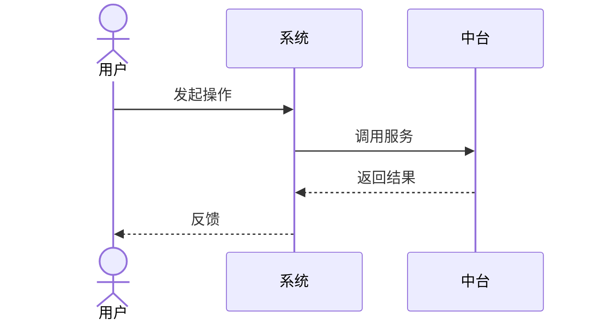
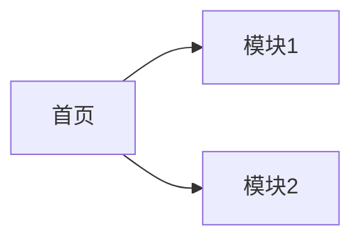
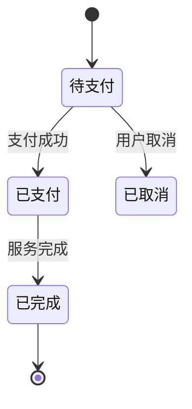

# PRD 模板（12 部分完整版）

> **N 节点**：S PRD 启动
> **主责智能体**：product-copilot（调用 `write-a-prd` 技能）
> **QG**：QG-S（详见 [01-标准层/03-质量门禁QG-D/S/B/Ship.md](../01-标准层/03-质量门禁QG-D/S/B/Ship.md) §三）
> **示例参考**：[附录-示例项目示例集.md](./附录-示例项目示例集.md) §1.2

---

## 文档信息

| 项目 | 内容 |
|------|------|
| 项目名称 | {填写} |
| 文档编号 | {PRD-{项目缩写}-2026-001} |
| 文档版本 | V1.0 |
| 编写日期 | {YYYY-MM-DD} |
| 产品经理 | {姓名} |
| 评审状态 | 待评审 / 已评审 / 已通过 |

### 修订记录

| 版本 | 日期 | 修订人 | 修订内容 | 交接契约引用 |
|------|------|--------|---------|---------------|
| V1.0 | {date} | PM | 初始版本 | S/iter 1 |

---

## Part 1：产品概述

### 1.1 项目背景

{业务背景 200-500 字。引用需求分析报告，不重写。}

### 1.2 产品定位

{一句话定位 + 目标用户 + 核心价值}

### 1.3 业务目标（可量化）

| 目标 | 指标 | 衡量方式 | 时间窗 |
|------|------|---------|--------|
| {用户增长} | {5 万} | {DB 统计} | {6 个月} |

---

## Part 2：用户与场景

### 2.1 用户角色

| 角色 | 描述 | 核心诉求 | 使用频率 |
|------|------|---------|---------|
| {C 端用户} | {描述} | {便捷} | 高频 |
| {B 端商户} | {描述} | {盈利} | 中频 |
| {G 端运营} | {描述} | {管控} | 高频 |

### 2.2 用户故事

| # | 角色 | 故事 | 验收标准 |
|---|------|------|---------|
| 1 | C 端用户 | 作为用户，我希望一键登录所有业态，以便省去重复注册 | 见 §验收标准清单 |

### 2.3 典型场景

| # | 场景 | 主角色 | 触发条件 | 期望结果 |
|---|------|--------|---------|---------|
| 1 | {停车缴费} | C 端用户 | {驶出停车场} | {扫码自动扣费} |

---

## Part 3：功能范围与优先级

### 3.1 功能全景图

```mermaid
graph TB
    System[{项目名}]
    System --> C[C 端]
    System --> B[B 端]
    System --> G[G 端]
    System --> Data[数据/大屏]
```

### 3.2 功能清单总表

| 模块 | P0 | P1 | P2 | 合计 |
|------|----|----|-----|------|
| {模块1} | {数} | {数} | {数} | {数} |
| **合计** | **{数}** | **{数}** | **{数}** | **{数}** |

### 3.3 MVP 范围

{列出 MVP 包含的功能点。明确不包含的功能。}

---

## Part 4：业务流程

### 4.1 核心业务流程



### 4.2 异常流程

| 异常场景 | 处理策略 |
|---------|---------|
| {网络中断} | {本地缓存 + 重试} |
| {并发冲突} | {乐观锁 + 提示} |

---

## Part 5：信息架构 / 导航

### 5.1 站点地图



### 5.2 关键页面跳转关系

{描述关键页面层级 + 跳转条件。}

---

## Part 6：数据模型概要

> ⚠ 详细数据模型在 [02-设计阶段/详细设计模板.md](../02-设计阶段/详细设计模板.md) §数据模型。本节只列**核心实体**。

### 6.1 核心实体清单

| 实体 | 描述 | 关键属性 | 关联 |
|------|------|---------|------|
| {用户} | 平台用户 | id/手机号/会员等级 | 关联 {订单} |
| {订单} | 业务订单 | id/类型/金额/状态 | 关联 {用户} |

### 6.2 数据字典（初稿）

{关键枚举值、状态定义。详细 DDL 见详设。}

---

## Part 7：详细功能描述

### 7.1 模块：{模块名}

#### 功能：{功能名}

- **优先级**：P0/P1/P2
- **用户故事**：见 Part 2.2
- **前置条件**：{填写}
- **业务规则**：{填写}
- **输入**：{字段/类型/校验规则}
- **输出**：{字段/格式}
- **状态机**（如有状态）：



- **接口概要**：见详设 §接口设计
- **验收标准**：
  - {Given-When-Then，可测试}

> 每个功能点都要有可测试的验收标准（**QG-S.2 ≥ 95% 可测试率**）。

---

## Part 8：非功能需求

### 8.1 性能需求

| 维度 | 指标 | 阈值 |
|------|------|------|
| 响应时间 P95 | 一般业务 | ≤ 200ms |
| 响应时间 P99 | 一般业务 | ≤ 500ms |
| QPS | 核心接口 | ≥ {N} |
| 并发用户 | — | ≥ {N} |

### 8.2 可用性

| 维度 | 阈值 |
|------|------|
| SLA | ≥ 99.5%（核心 ≥ 99.9%） |
| 故障恢复 | RTO ≤ 30min / RPO ≤ 5min |

### 8.3 安全需求

- OWASP Top 10 严重漏洞 = 0
- 鉴权覆盖率 100%（敏感接口）
- 敏感数据加密 100%（传输+存储）
- 合规：{按行业}

### 8.4 可维护性

- 单测覆盖率（核心）≥ 90%
- 单测覆盖率（一般）≥ 70%
- 代码规范：{ESLint/Checkstyle}

---

## Part 9：用户体验要求

### 9.1 设计风格

{极简/扁平/拟物，参考 Design System：TDesign / Ant Design / Element Plus / Arco / Semi / shadcn。}

### 9.2 响应式

- 桌面：≥ 1280px
- 平板：768-1280px
- 移动：≤ 768px

### 9.3 无障碍

- WCAG 2.1 AA 级
- 关键操作键盘可达

---

## Part 10：数据需求

### 10.1 数据来源

| 数据 | 来源 | 获取方式 |
|------|------|---------|
| {用户} | 自有 | 注册 |
| {商品} | ERP | API 同步 |

### 10.2 数据流向

{描述数据从采集 → 处理 → 存储 → 销毁的全生命周期。}

### 10.3 数据合规

{GDPR / 个保法 / 数据安全法等。}

---

## Part 11：约束与依赖

### 11.1 技术约束

- 技术栈：{必填}
- 部署环境：{云/私有云/混合}
- 兼容性：{浏览器/设备}

### 11.2 业务约束

- 上线时间：{deadline}
- 预算：{金额}
- 合规：{行业}

### 11.3 外部依赖

| 依赖 | 提供方 | 接口形式 | 责任人 |
|------|--------|---------|--------|
| {支付} | {第三方} | {API} | {填写} |

---

## Part 12：附录

### 12.1 术语表

| 术语 | 定义 |
|------|------|
| {术语} | {定义} |

### 12.2 参考资料

- 需求分析报告：[链接]
- 技术方案：[链接]

### 12.3 验收标准清单（汇总）

| # | 功能点 | 验收标准 | 可测试 | 来源 |
|---|--------|---------|--------|------|
| 1 | {登录} | 输入正确账号密码 → 跳转首页 | ✅ | Part 7 |

> ⚠ 可测试验收标准 ≥ 95%（QG-S.2）。

---

## 验收标准

本产物通过 QG-S 部分检查项：

| 检查项 | 通过标准 | 实际 | 状态 |
|--------|---------|------|------|
| QG-S.1 PRD 12 部分完整度 | 12/12 全绿 | {填写} | ☐ |
| QG-S.2 验收标准可测试 | ≥ 95% | {填写} | ☐ |
| QG-S.3 PRD 评审会签字 | 评审会通过 + 签字 | {填写} | ☐ |
| QG-S.4 原型 Demo | Demo HTML 可访问 | {填写} | ☐ |

---

## 版本记录

| 版本 | 日期 | 触发原因 | 主要 diff | 交接契约引用 |
|------|------|---------|----------|---------------|
| V1.0 | {date} | 初稿 | — | S/iter 1 |
| V1.1 | {date} | 评审反馈 | {简述} | S/iter 2 |
| V2.0 | {date} | S 架构反馈 | {简述} | S/iter 3 |

---

## Loop 微循环 字段（S Loop 微循环）

| 字段 | 内容 |
|------|------|
| Plan | 列 PRD 12 部分 + 用户故事 + 验收标准清单 |
| Act | write-a-prd 主导生成 PRD 草稿 + Demo 原型 |
| Observe | 12 部分完整度 + 功能点可测试性自动检查 |
| Reflect | PRD 评审会 + 用户验证（Demo 走查） |
| Exit | 12 部分全绿 + 验收标准 100% 可测试 + 评审签字 |

详见 [01-标准层/01-全程统一阶段定义.md](../01-标准层/01-全程统一阶段定义.md) §S。

---

*本模板是「PRD」的标准结构。示例项目完整示例见 [附录-示例项目示例集.md](./附录-示例项目示例集.md) §1.2。*
