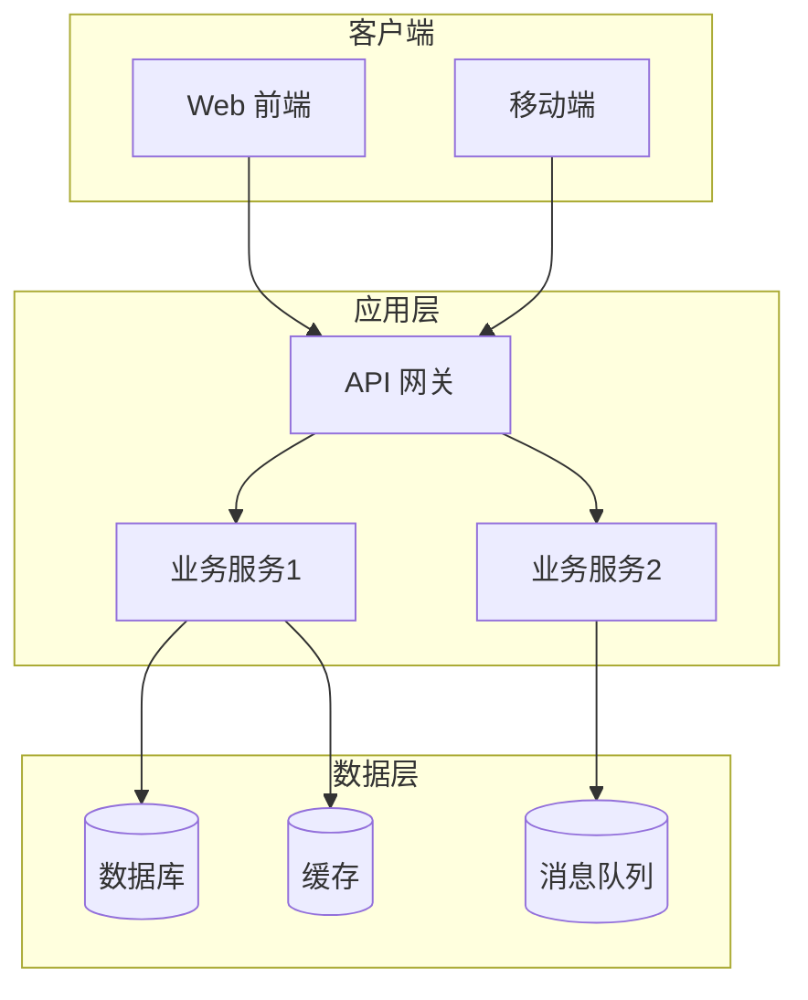
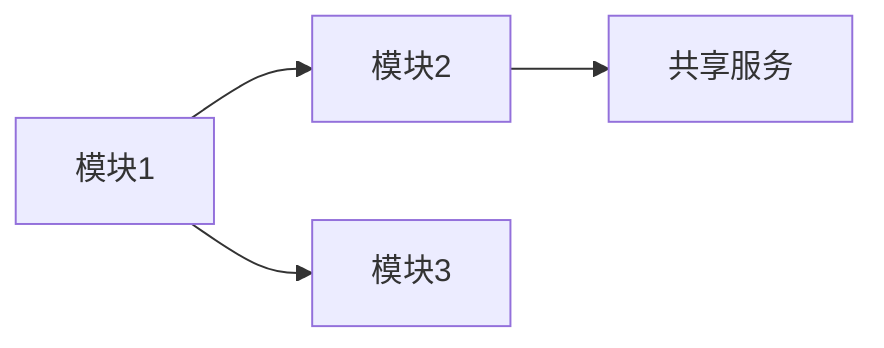
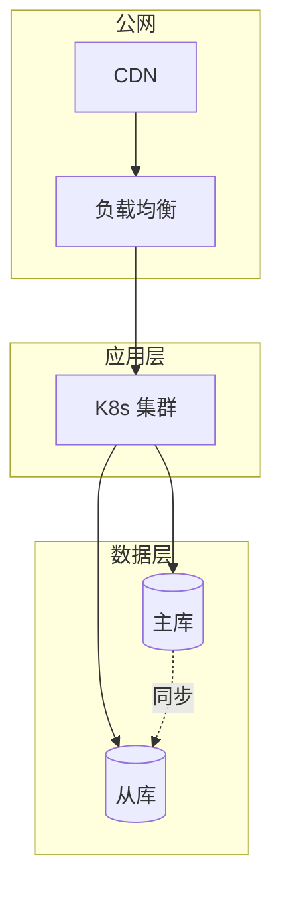

# 架构设计模板

> **N 节点**：S 架构设计
> **主责智能体**：dev-copilot（调用 `architecture-designer` 技能）
> **QG**：QG-S（详见 [01-标准层/03-质量门禁QG-D/S/B/Ship.md](../01-标准层/03-质量门禁QG-D/S/B/Ship.md) §三）
> **示例参考**：[附录-示例项目示例集.md](./附录-示例项目示例集.md) §2.1

---

## 文档信息

| 项目 | 内容 |
|------|------|
| 项目名称 | {填写} |
| 文档编号 | {ARCH-{项目缩写}-2026-001} |
| 文档版本 | V1.0 |
| 编写日期 | {YYYY-MM-DD} |
| 架构师 | {姓名} |
| 评审状态 | 待评审 / 已评审 / 已通过 |

### 修订记录

| 版本 | 日期 | 修订人 | 修订内容 | 交接契约引用 |
|------|------|--------|---------|---------------|
| V1.0 | {date} | {name} | 初始版本 | S/iter 1 |

---

## 正文（7 章节）

### 第 1 章 概述 + 设计原则

#### 1.1 文档目的

{本文档为 {项目名} 的架构设计，定稿后将指导详细设计、编码实现。}

#### 1.2 与 PRD 对齐

{引用 PRD Part 2 业务目标，确保架构对齐业务。}

#### 1.3 设计原则（3-7 条）

- **分层解耦**：业务/中台/基础设施三层分离
- **服务化**：核心能力服务化，避免大单体
- **安全优先**：默认安全（zero trust）
- **可扩展**：水平扩展优先于垂直
- **可观测**：日志/指标/追踪三位一体
- **合规**：{按行业}

### 第 2 章 架构总览（C4 视图）

#### 2.1 Context 视图（系统边界）

```mermaid
graph TB
    System[{项目名}]
    User[终端用户]
    Admin[管理员]
    Ext1[外部系统1]
    User --> System
    Admin --> System
    System <--> Ext1
```

#### 2.2 Container 视图（部署单元）



#### 2.3 Component 视图（关键模块）

{关键服务的内部组件分解。}

#### 2.4 Deployment 视图（物理部署）

{物理拓扑 + 网络分区。}

> ⚠ C4 四视图完整度 100%（QG-S.6 硬阻塞）。

### 第 3 章 模块划分

| 模块 | 职责（一句话） | 关键接口 | 依赖 | 团队 |
|------|--------------|---------|------|------|
| {模块1} | {描述} | {API} | {模块2} | {团队} |

#### 模块依赖关系图



### 第 4 章 技术选型

#### 4.1 选型原则

- 主流稳定（社区活跃、商业支持）
- 团队熟悉度
- 与现有技术栈一致性
- 性能/成本平衡

#### 4.2 逐层选型（每项 ≥ 2 备选对比）

| 层 | 候选 1 | 候选 2 | 选择 | 理由 |
|----|--------|--------|------|------|
| 前端框架 | React | Vue | {选择} | {理由} |
| UI 组件库 | Ant Design | TDesign | {选择} | {理由} |
| 后端框架 | Spring Boot | Node.js | {选择} | {理由} |
| 数据库 | MySQL | PostgreSQL | {选择} | {理由} |
| 缓存 | Redis | Memcached | {选择} | {理由} |
| 消息队列 | Kafka | RocketMQ | {选择} | {理由} |
| 容器编排 | K8s | Docker Swarm | {选择} | {理由} |
| 监控 | Prometheus | Zabbix | {选择} | {理由} |
| 日志 | ELK | Loki | {选择} | {理由} |

> ⚠ 每项 ≥ 2 备选对比（架构评审 Gate 1 检查项）。

### 第 5 章 数据架构

#### 5.1 数据库选型 + 分库分表策略

| 业务域 | 数据库 | 分片策略 | 备份策略 |
|--------|--------|---------|---------|
| {用户域} | MySQL | {按用户ID} | {主从+定时} |

#### 5.2 数据流（实时 + 批量）

{描述数据流向。}

#### 5.3 数据治理

- 数据标准：{命名/格式}
- 数据质量：{监控指标}
- 数据生命周期：{归档/销毁}

### 第 6 章 非功能性设计

#### 6.1 性能

| 指标 | 阈值 | 策略 |
|------|------|------|
| P95 响应 | ≤ 200ms | 缓存 + 异步 |
| QPS | ≥ {N} | 水平扩展 + 限流 |

> 性能指标权威源见 [01-标准层/07-产物质量硬指标库.md](../01-标准层/07-产物质量硬指标库.md) §6.1。

#### 6.2 可用性

- SLA：≥ 99.5%（核心 ≥ 99.9%）
- 多机房 / 多可用区
- 故障转移：自动 + 手动双重

#### 6.3 安全

- 鉴权：OAuth2 / JWT
- 加密：TLS 1.3 + AES-256
- 审计：日志全留痕
- OWASP Top 10：逐项应对

#### 6.4 可维护性

- 单测覆盖率：核心 ≥ 90% / 一般 ≥ 70%
- 代码规范：{ESLint/Checkstyle}
- 文档同步：架构变更同步更新

> ⚠ 非功能需求覆盖率 100%（QG-S.7）。

### 第 7 章 部署 + 运维

#### 7.1 部署架构图



#### 7.2 CI/CD 流水线


#### 7.3 监控告警

| 指标 | 阈值 | 告警 |
|------|------|------|
| CPU | > 80% | P2 |
| 错误率 | > 1% | P1 |
| 响应 P99 | > 1s | P2 |

#### 7.4 **回滚预案**（Ship 必须引用）

- **代码回滚**：`git revert`（推荐）或 `git reset`
- **数据库回滚**：每次变更准备回滚 DDL
- **部署回滚**：自动跑回滚脚本 + 镜像回退
- **回滚决策人**：{运维 + 业务签字}

> ⚠ 回滚预案缺失是 Ship 部署失败的根因之一。

---

## ADR（架构决策记录）

> 关键决策必须有 ADR，归档至 `项目文档/{项目}/03-设计/adr/`。

| ADR # | 决策 | 备选 | 选择理由 | 日期 |
|-------|------|------|---------|------|
| ADR-001 | {是否上微服务} | 单体/微服务 | {理由} | {date} |
| ADR-002 | {数据库选型} | MySQL/PG | {理由} | {date} |

---

## 验收标准

本产物通过 QG-S 部分检查项：

| 检查项 | 通过标准 | 实际 | 状态 |
|--------|---------|------|------|
| QG-S.5 架构文档 7 章节 | 7 章节 100% 完整 | {填写} | ☐ |
| QG-S.6 架构 4 视图 | C4 四视图全 | {填写} | ☐ |
| QG-S.7 非功能需求覆盖 | 4 类 100% | {填写} | ☐ |
| QG-S.8 架构评审 | 评审委员会通过 | {填写} | ☐ |
| QG-S.9 ADR 完整 | 关键决策有 ADR | {填写} | ☐ |

---

## 版本记录

| 版本 | 日期 | 触发原因 | 主要 diff | 交接契约引用 |
|------|------|---------|----------|---------------|
| V1.0 | {date} | 初稿 | — | S/iter 1 |
| V1.1 | {date} | 架构评审 | {简述} | S/iter 2 |

---

## Loop 微循环 字段（S Loop 微循环）

| 字段 | 内容 |
|------|------|
| Plan | 列架构视图（C4/部署/数据/集成） + 技术选型清单 |
| Act | architecture-designer 主导生成架构文档 |
| Observe | ATAM 评估（性能/可用/安全/可维） |
| Reflect | 架构评审委员会 + ops 反馈 |
| Exit | 架构评审通过 + 关键风险有缓解方案 |

详见 [01-标准层/01-全程统一阶段定义.md](../01-标准层/01-全程统一阶段定义.md) §S。

---

*本模板是「架构设计」的标准结构。示例项目完整示例见 [附录-示例项目示例集.md](./附录-示例项目示例集.md) §2.1。*
