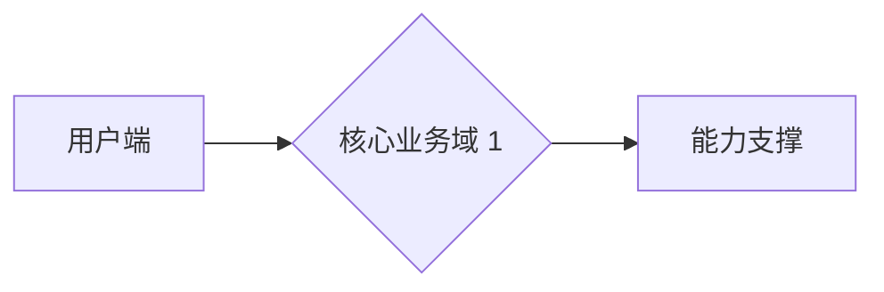

# 产品方案模板

> **阶段**：设计（S）前半——产品侧解决路径设计（区别于技术方案：技术方案面向架构与实现，产品方案面向业务与功能的解决路径）
> **主责智能体**：product-copilot（协 pre-sales-copilot）
> **QG**：QG-设计.11 需求-方案覆盖矩阵（详见 [01-标准层/03-质量门禁QG-需求至QG-交付.md](../01-标准层/03-质量门禁QG-需求至QG-交付.md) §三）
> **上游**：[需求分析报告](../需求/需求分析报告模板.md) / [需求清单](../需求/需求清单模板.md)（REQ-NNN）
> **下游**：[产品原型设计](./产品原型设计规范.md)（原型页面按方案项展开）/ [技术方案](./技术方案模板.md) / [PRD](./PRD模板.md)

---

## 文档信息

| 项目 | 内容 |
|------|------|
| 项目名称 | {填写} |
| 文档编号 | {PSU-{项目缩写}-2026-001} |
| 文档版本 | V1.0 |
| 编写日期 | {YYYY-MM-DD} |
| 编写人 | {姓名/角色} |
| 评审状态 | 待评审 / 已评审 / 已通过 |

### 修订记录

| 版本 | 日期 | 修订人 | 修订内容 | 交接契约引用 |
|------|------|--------|---------|---------------|
| V1.0 | {date} | {name} | 初始版本 | S/iter 1 |

---

## 使用说明（必读）

1. **定位**：产品方案回答「**用什么产品形态满足需求**」——在需求（问题域）与 PRD（实现规范）之间搭桥。技术方案回答「用什么技术栈与架构实现」，两者互补，小型项目可合并到技术方案中（合并时本模板 §二 覆盖矩阵仍强制保留）。
2. **REQ 贯通**：覆盖矩阵以 `REQ-NNN` 为主键，每条需求必须有对应方案项（双向核对：无遗漏需求、无无源方案项）。
3. **HITL**：对外交付物，HITL-In，产品评审会签字。

---

## 正文

### 一、方案概述

{一段话说明产品形态与核心思路：目标用户、解决路径、核心价值。200-300 字。}

| 项目 | 内容 |
|------|------|
| 产品形态 | {Web 平台 / 移动 App / 小程序 / 混合} |
| 目标用户 | {引用需求分析报告角色矩阵} |
| 核心价值主张 | {一句话} |
| 阶段划分 | {一期 MVP 范围 / 二期规划} |

### 二、需求-方案覆盖矩阵

> ⚠ 本表是本产物的核心（QG-设计.11 硬阻塞）：每条 REQ 必须有对应方案项；每个方案项必须能回溯到 REQ（无源方案项=镀金，须删除或补充需求）。

| 需求 ID | 需求摘要 | 方案项 | 说明 | 覆盖方式 |
|---------|---------|--------|------|---------|
| REQ-001 | {拍照上传发票} | F1 移动端报销发起 | {手机拍照 + OCR 识别} | 完全覆盖 |
| REQ-002 | {三级审批} | F2 审批流引擎 | {可配置审批流} | 完全覆盖 |
| REQ-101 | {性能 P95≤2s} | NF1 非功能设计 | {见技术方案性能章节} | 转技术方案 |

**统计**：需求总数 {N}（P0 {n} / P1 {n} / P2 {n}），已覆盖 {N}，覆盖率 **100%**。

### 三、总体设计

#### 3.1 业务全景

{描述产品整体业务结构。建议附 Mermaid 图。}

#### 3.2 流程设计（To-Be）

{引用需求分析报告 To-Be 流程，并说明方案如何落地该流程。流程图源文件入库 `项目文档/{项目}/设计/流程图/*.mmd`。}

#### 3.3 信息架构

{产品一级模块划分与页面结构概述，详细页面树在原型阶段展开。}

### 四、功能设计分述

> 每个方案项一节，编号 F1/F2/…（与覆盖矩阵对应）。

#### F1 {功能名}

| 项目 | 内容 |
|------|------|
| 对应需求 | REQ-001, REQ-004 |
| 功能描述 | {做什么} |
| 关键规则 | {业务规则/计算逻辑} |
| 边界与异常 | {超出范围的处理} |

### 五、方案边界（做什么 / 不做什么）

| # | 范围内 | 范围外 | 原因 |
|---|--------|--------|------|
| 1 | {F1 移动端报销发起} | {PC 端报销发起} | {一期聚焦移动} |

> 与需求确认书「范围外事项」保持一致，不得扩大或缩小。

### 六、可行性结论

| 维度 | 结论 | 依据 |
|------|------|------|
| 技术可行性 | {可行/有风险/不可行} | {技术预研结论，风险项进登记册} |
| 资源可行性 | {所需人力/周期} | {WBS 估算} |
| 周期可行性 | {能否满足里程碑} | {与约束基线对照} |

### 七、与竞品/现状对比

| 维度 | 现状/竞品 A | 本方案 | 差异化结论 |
|------|------------|--------|-----------|
| {报销时效} | {5 天} | {当天} | {核心卖点} |

---

## 验收标准

本产物通过 QG-设计 部分检查项：

| 检查项 | 通过标准 | 实际 | 状态 |
|--------|---------|------|------|
| QG-设计.11 需求-方案覆盖矩阵 | 每条 REQ 有方案项，无无源方案项（双向核对 100%） | {填写} | ☐ |
| 方案边界明确 | 做什么/不做什么逐条列明，与需求确认书一致 | {填写} | ☐ |
| 可行性结论完整 | 技术/资源/周期三维均有结论 | {填写} | ☐ |
| 人工审阅签字 | 产品评审会签字 | {填写} | ☐ |

完整 QG-设计 checklist 见 [01-标准层/03-质量门禁QG-需求至QG-交付.md](../01-标准层/03-质量门禁QG-需求至QG-交付.md) §三。

---

## 版本记录

| 版本 | 日期 | 触发原因 | 主要 diff | 交接契约引用 |
|------|------|---------|----------|---------------|
| V1.0 | {date} | 初稿 | — | S/iter 1 |
| V1.1 | {date} | 评审反馈 | {F2 增加代理审批} | S/iter 2 |
| V2.0 | {date} | 需求变更 | {新增 F5，基线升 V2.0} | S/iter 3 |

---

*本模板是「产品方案」的标准结构。覆盖矩阵中的 F 编号（F1/F2/…）将被原型页面树与 PRD 功能总览引用。*
