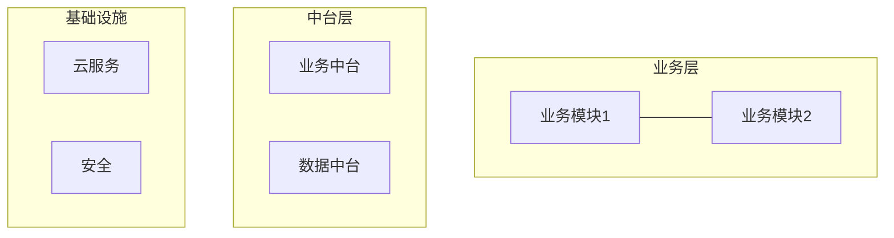

# 技术方案模板

> **阶段**：需求阶段方案编写
> **主责智能体**：pre-sales-copilot（调用 `solution-architect` 技能）
> **QG**：QG-需求（详见 [01-标准层/03-质量门禁QG-需求至QG-交付.md](../01-标准层/03-质量门禁QG-需求至QG-交付.md) §二）
> **方案类型**：技术方案（11 章）/ 解决方案（7 章）/ 架构设计（8 章），按场景三选一
> **示例参考**：[附录-示例项目示例集.md](./附录-示例项目示例集.md) §1.3

---

## 文档信息

| 项目 | 内容 |
|------|------|
| 项目名称 | {填写} |
| 文档编号 | {TS-{项目缩写}-2026-001} |
| 文档版本 | V1.0 |
| 编写日期 | {YYYY-MM-DD} |
| 方案类型 | 技术方案 / 解决方案 / 架构设计 |
| 评审状态 | 待评审 / 已评审 / 已通过 |

### 修订记录

| 版本 | 日期 | 修订人 | 修订内容 | 交接契约引用 |
|------|------|--------|---------|---------------|
| V1.0 | {date} | {name} | 初始版本 | D/iter 1 |

---

## 正文（按方案类型选用）

### 类型 A：技术方案（11 章节，最完整）

适用：投标 / 客户演示 / 大型项目立项。

#### 第 1 章 项目概述
- 1.1 项目背景（同需求分析报告 §1.1）
- 1.2 建设目标（同需求分析报告 §1.2）
- 1.3 建设原则（安全/可靠/可扩展/易用/合规）
- 1.4 术语定义

#### 第 2 章 需求理解
- 2.1 业务需求理解（**引用需求分析报告，不重写**）
- 2.2 功能需求清单（**引用 PRD Part 3，不重写**）
- 2.3 非功能需求（性能/可用/安全/可维/合规）
- 2.4 约束条件（时间/预算/技术栈/合规）

#### 第 3 章 总体架构
- 3.1 设计原则（5-7 条：分层/解耦/服务化/安全优先/可扩展/可观测/合规）
- 3.2 总体架构图（C4 Context + Container，至少 1 张 Mermaid）
- 3.3 业务能力地图
- 3.4 系统边界（与外部系统交互）

#### 第 4 章 技术选型
- 4.1 选型原则
- 4.2 逐层选型（每项 ≥ 2 备选对比）：

| 层 | 候选 1 | 候选 2 | 选择 | 理由 |
|----|--------|--------|------|------|
| 前端 | React | Vue | {选择} | {理由} |
| 后端 | Spring Boot | Node.js | {选择} | {理由} |
| 数据库 | MySQL | PostgreSQL | {选择} | {理由} |
| 缓存 | Redis | Memcached | {选择} | {理由} |
| MQ | Kafka | RocketMQ | {选择} | {理由} |
| 部署 | K8s | Docker Swarm | {选择} | {理由} |

#### 第 5 章 详细设计
- 5.1 核心业务流程（Mermaid sequenceDiagram）
- 5.2 数据模型（ER 图，**引用 S 详设**）
- 5.3 接口设计概要（**引用 S 详设 OpenAPI**）

#### 第 6 章 安全设计
- 6.1 安全架构（鉴权/授权/加密/审计）
- 6.2 OWASP Top 10 应对（逐项说明）
- 6.3 数据安全（传输/存储/备份）
- 6.4 合规要求（GDPR / 等保 / 行业标准）

#### 第 7 章 性能设计
- 7.1 性能指标（**引用 [01-标准层/06-产物质量硬指标库.md](../../01-标准层/06-产物质量硬指标库.md) §6.1**）
- 7.2 容量规划
- 7.3 性能优化策略（缓存/异步/读写分离/分库分表）

#### 第 8 章 部署与运维
- 8.1 部署架构图
- 8.2 CI/CD 流水线
- 8.3 监控告警
- 8.4 **回滚预案**（**交付阶段部署必须前置引用**）

#### 第 9 章 项目实施
- 9.1 实施方法论（**引用 [00-理论层/01-Loop工程与敏捷融合原理.md](../00-理论层/01-Loop工程与敏捷融合原理.md)**）
- 9.2 WBS（**引用项目管理产物模板**）
- 9.3 里程碑
- 9.4 资源计划
- 9.5 风险管理（**引用项目管理 §风险管理**）

#### 第 10 章 服务保障
- 10.1 售后服务（SLA）
- 10.2 培训计划（**引用 交付阶段培训材料**）
- 10.3 文档清单

#### 第 11 章 商务方案（可选）
- 11.1 报价
- 11.2 付款方式
- 11.3 知识产权

---

### 类型 B：解决方案（7 章节，营销+方案）

适用：客户演示 / 标书前 7 章。

1. 客户痛点与业务价值
2. 解决方案概述（含 1 张总图）
3. 核心能力（功能列表）
4. 技术架构（精简版）
5. 实施路径
6. 服务保障
7. 成功案例

---

### 类型 C：架构设计（8 章节）

适用：内部架构立项 / 设计阶段架构设计阶段产物。

> **注意**：本类型与 [02-设计阶段/架构设计模板.md](../02-设计阶段/架构设计模板.md) **重叠**。设计阶段直接使用架构设计模板，需求阶段只在方案中**引用**架构（避免双重维护）。

1. 概述 + 设计原则
2. 架构总览（C4 四视图）
3. 模块划分
4. 技术选型
5. 数据架构
6. 集成架构
7. 非功能性设计
8. 部署 + 运维

---

## 验收标准

本产物通过 QG-需求 部分检查项：

| 检查项 | 通过标准 | 实际 | 状态 |
|--------|---------|------|------|
| QG-需求.5 技术方案章节完整度 | 100%（按 11/7/8 章模板） | {填写} | ☐ |
| QG-需求.6 技术方案评审 | 技术评审会通过 | {填写} | ☐ |
| QG-需求.7 客户预认可 | 客户预认可（非正式可） | {填写} | ☐ |

技术评审一次通过率 ≥ 70%（详见 [01-标准层/06-产物质量硬指标库.md](../../01-标准层/06-产物质量硬指标库.md) §二）。

---

## 版本记录

| 版本 | 日期 | 触发原因 | 主要 diff | 交接契约引用 |
|------|------|---------|----------|---------------|
| V1.0 | {date} | 初稿 | — | D/iter 1 |
| V1.1 | {date} | 评审反馈 | {简述} | D/iter 2 |
| V2.0 | {date} | 客户变更 | {简述} | D/iter 3 |

---

## Loop 微循环 字段（D Loop 微循环）

| 字段 | 内容 |
|------|------|
| Plan | 列方案章节（11/7/8） + 评审人 |
| Act | solution-architect 主导生成方案草稿 |
| Observe | 章节完整度检查 + 模板匹配度 |
| Reflect | 技术评审会 + 客户预沟通 |
| Exit | 技术评审通过 + 客户预认可 + QG-需求.5/1.6/1.7 通过 |

详见 [01-标准层/01-全程统一阶段定义.md](../01-标准层/01-全程统一阶段定义.md) §D。

---

*本模板是「技术方案」的标准结构。示例项目完整示例见 [附录-示例项目示例集.md](./附录-示例项目示例集.md) §1.3。*
