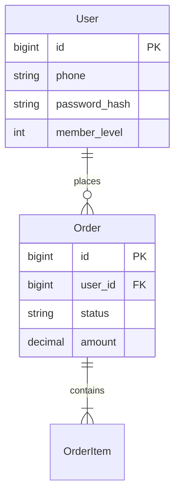
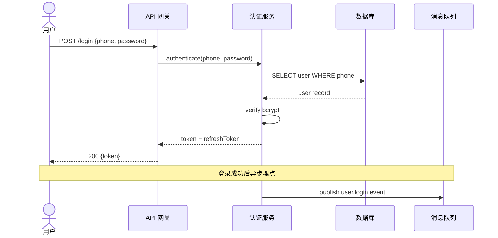
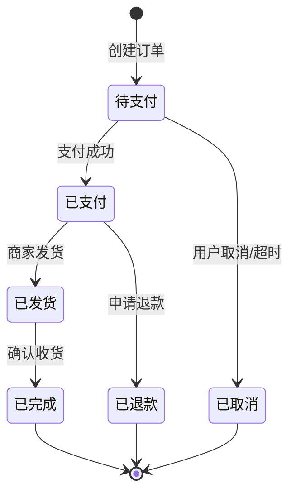

# 详细设计模板

> **阶段**：设计阶段详细设计
> **主责智能体**：dev-copilot（调用 `detailed-designer` 技能）
> **QG**：QG-设计（详见 [01-标准层/03-质量门禁QG-需求至QG-交付.md](../01-标准层/03-质量门禁QG-需求至QG-交付.md) §三）
> **示例参考**：[附录-示例项目示例集.md](./附录-示例项目示例集.md) §2.2

---

## 文档信息

| 项目 | 内容 |
|------|------|
| 项目名称 | {填写} |
| 文档编号 | {DD-{项目缩写}-2026-001} |
| 文档版本 | V1.0 |
| 编写日期 | {YYYY-MM-DD} |
| 开发负责人 | {姓名} |
| 评审状态 | 待评审 / 已评审 / 已通过 |

### 修订记录

| 版本 | 日期 | 修订人 | 修订内容 | 交接契约引用 |
|------|------|--------|---------|---------------|
| V1.0 | {date} | {name} | 初始版本 | S/iter 1 |

---

## 正文

### 一、接口设计（OpenAPI 3.0）

> ⚠ 接口定义 100% 完整（端点/方法/请求/响应/错误码/鉴权）—— **QG-设计.10 硬阻塞**。
>
> Swagger/OpenAPI 文件归档至 `项目文档/{项目}/03-设计/api-docs/openapi.yaml`。

#### 1.1 接口清单

| # | 模块 | 端点 | 方法 | 鉴权 | 描述 |
|---|------|------|------|------|------|
| 1 | {认证} | `/api/v1/auth/login` | POST | 公开 | 用户登录 |
| 2 | {订单} | `/api/v1/orders` | GET | Bearer | 查询订单 |

#### 1.2 接口详细定义（示例）

```yaml
openapi: 3.0.3
paths:
  /api/v1/auth/login:
    post:
      summary: 用户登录
      security: []  # 公开接口
      requestBody:
        required: true
        content:
          application/json:
            schema:
              type: object
              required: [phone, password]
              properties:
                phone: { type: string, example: "13800138000" }
                password: { type: string, format: password }
      responses:
        '200':
          description: 登录成功
          content:
            application/json:
              schema:
                type: object
                properties:
                  token: { type: string }
                  refreshToken: { type: string }
                  expiresIn: { type: integer }
        '401': { description: 账号或密码错误 }
        '423': { description: 账号已锁定 }
        '429': { description: 请求过于频繁 }
```

#### 1.3 错误码标准

| 错误码 | HTTP | 含义 | 处理建议 |
|--------|------|------|---------|
| `AUTH_001` | 401 | 未授权 | 跳登录 |
| `AUTH_002` | 403 | 无权限 | 联系管理员 |
| `VAL_001` | 400 | 参数错误 | 检查输入 |
| `BIZ_001` | 409 | 业务冲突 | 提示用户 |

---

### 二、数据模型

#### 2.1 ER 图



#### 2.2 DDL

```sql
CREATE TABLE `user` (
  `id` BIGINT PRIMARY KEY AUTO_INCREMENT,
  `phone` VARCHAR(20) NOT NULL UNIQUE,
  `password_hash` VARCHAR(255) NOT NULL,
  `member_level` TINYINT DEFAULT 1,
  `created_at` DATETIME DEFAULT CURRENT_TIMESTAMP,
  INDEX idx_phone (phone)
) ENGINE=InnoDB DEFAULT CHARSET=utf8mb4;

CREATE TABLE `order` (
  `id` BIGINT PRIMARY KEY AUTO_INCREMENT,
  `user_id` BIGINT NOT NULL,
  `status` VARCHAR(20) NOT NULL DEFAULT 'pending',
  `amount` DECIMAL(10,2) NOT NULL,
  `created_at` DATETIME DEFAULT CURRENT_TIMESTAMP,
  INDEX idx_user (user_id),
  INDEX idx_status_created (status, created_at)
) ENGINE=InnoDB DEFAULT CHARSET=utf8mb4;
```

#### 2.3 索引策略

| 表 | 索引 | 类型 | 用途 |
|----|------|------|------|
| user | idx_phone | UNIQUE | 登录查询 |
| order | idx_user | NORMAL | 用户订单列表 |
| order | idx_status_created | COMPOSITE | 后台按状态查询 |

#### 2.4 迁移脚本

- Up：`V{date}__add_user_table.sql`
- Down：`V{date}__drop_user_table.sql`

> ⚠ **铁律**：所有 DDL 必须配套回滚 DDL（开发阶段编码前置约束）。

---

### 三、时序图（核心业务流程）



> 时序图覆盖核心业务流程（**对齐 PRD Part 6**）。

---

### 四、状态机

#### 4.1 订单状态机



#### 4.2 状态转换规则表

| 当前状态 | 事件 | 目标状态 | 触发动作 | 权限 |
|---------|------|---------|---------|------|
| 待支付 | 支付成功 | 已支付 | 发券/通知 | 系统 |
| 待支付 | 超时 30min | 已取消 | 释放库存 | 系统 |
| 已支付 | 申请退款 | 退款审核中 | 通知客服 | 用户 |

> ⚠ 有状态实体 100% 覆盖（状态机完整度，硬指标见 [01-标准层/06-产物质量硬指标库.md](../../01-标准层/06-产物质量硬指标库.md) §三；对应 QG-设计.4）。

---

### 五、业务规则

| 规则 # | 名称 | 描述 | 实现位置 |
|--------|------|------|---------|
| BR-001 | {并发控制} | {乐观锁 + 重试 3 次} | {order.service.ts} |
| BR-002 | {金额校验} | {金额 > 0 且 ≤ 单笔上限} | {order.dto.ts} |

---

### 六、安全设计

#### 6.1 鉴权策略

- JWT (access token 1h / refresh token 7d)
- 敏感操作二次验证（短信/邮箱）

#### 6.2 越权防护

- 资源 owner 校验（每个查询带 user_id 过滤）
- 接口级 RBAC

#### 6.3 输入校验

- 所有入参 DTO 校验（class-validator / pydantic）
- SQL 注入防护（参数化查询）
- XSS 防护（输出编码）

---

## 验收标准

本产物通过 QG-设计 部分检查项：

| 检查项 | 通过标准 | 实际 | 状态 |
|--------|---------|------|------|
| QG-设计.4 详细设计覆盖 | 关键模块 100% 有详设（含接口/数据模型/时序） | {填写} | ☐ |
| QG-设计.6 接口契约一致 | 端点/方法/请求/响应/错误码/鉴权 100% | {填写} | ☐ |
| 状态机完整度（硬指标） | 有状态实体 100% 覆盖，无悬挂状态 | {填写} | ☐ |

补充指标（详见 [01-标准层/06-产物质量硬指标库.md](../../01-标准层/06-产物质量硬指标库.md) §三）：
- 功能点-接口对照率 100%
- 状态机完整度 100%

---

## 版本记录

| 版本 | 日期 | 触发原因 | 主要 diff | 交接契约引用 |
|------|------|---------|----------|---------------|
| V1.0 | {date} | 初稿 | — | S/iter 1 |
| V1.1 | {date} | 评审反馈 | {简述} | S/iter 2 |

---

## Loop 微循环 字段（S Loop 微循环）

| 字段 | 内容 |
|------|------|
| Plan | 列接口/数据模型/时序图/状态机清单 |
| Act | detailed-designer 主导生成详设文档 |
| Observe | 接口与 PRD 功能点对照；数据模型范式检查 |
| Reflect | 开发负责人审 + 测试参与设计评审 |
| Exit | 接口 100% + 状态机无遗漏 + QG-设计.10-2.12 通过 |

详见 [01-标准层/01-全程统一阶段定义.md](../01-标准层/01-全程统一阶段定义.md) §S。

---

*本模板是「详细设计」的标准结构。示例项目完整示例见 [附录-示例项目示例集.md](./附录-示例项目示例集.md) §2.2。*
