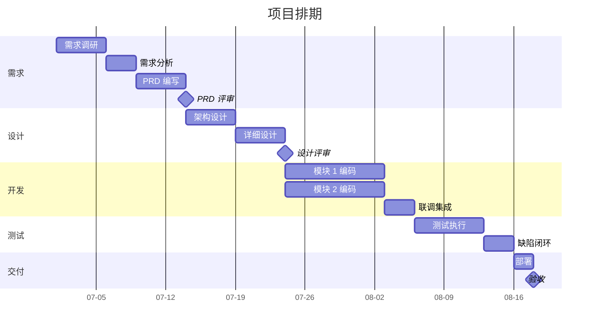

# 项目管理产物模板

> **阶段**：贯穿 全程（项目管理是横向能力，非单点节点）
> **主责智能体**：project-copilot
> **QG**：参与全部 QG-需求/QG-设计/QG-开发/QG-交付（项目管理视角的合规检查）
> **关联**：项目类型路由见 [00-理论层/01-Loop工程与敏捷融合原理.md](../../00-理论层/01-Loop工程与敏捷融合原理.md) §三

---

## 文档信息

| 项目 | 内容 |
|------|------|
| 项目名称 | {填写} |
| 文档编号 | {PM-{项目缩写}-2026-001} |
| 文档版本 | V1.0 |
| 编写日期 | {YYYY-MM-DD} |
| 项目经理 | {姓名} |
| 项目类型 | 瀑布 / 迭代 MVP / 敏捷（见路由规则） |

### 修订记录

| 版本 | 日期 | 修订人 | 修订内容 | 交接契约引用 |
|------|------|--------|---------|---------------|
| V1.0 | {date} | {name} | 初始版本 | PM/iter 1 |

---

## 正文

### 一、项目章程（D 启动）

#### 1.1 项目目标（SMART）

| 维度 | 目标 | 衡量指标 |
|------|------|---------|
| 业务 | {例：提升订单转化率} | {例：+15%} |
| 交付 | {例：3 个月内上线} | {例：按期发布} |
| 质量 | {例：P0/P1 缺陷清零} | {例：QG-交付 通过} |
| 成本 | {例：人力 ≤ 100 人天} | {例：实际 ≤ 预算} |

#### 1.2 干系人清单

| # | 角色 | 姓名 | 关注点 | 影响力 | 参与度 |
|---|------|------|--------|--------|--------|
| 1 | 项目发起人 | {name} | ROI | 高 | 低 |
| 2 | 产品经理 | {name} | 需求满足 | 高 | 高 |
| 3 | 技术负责人 | {name} | 可实现性 | 高 | 高 |
| 4 | 客户验收人 | {name} | 验收通过 | 高 | 中 |

#### 1.3 项目范围（In/Out Scope）

- **In Scope**：{列出本次交付范围}
- **Out Scope**：{明确不做的内容，避免范围蔓延}

---

### 二、WBS 工作分解（跨阶段）

> ⚠ WBS 分解到可估算、可分配、可跟踪的工作包（8-80 小时粒度）。

#### 2.1 WBS 结构

```
项目
├── 1. 需求（跨阶段）
│   ├── 1.1 需求调研
│   ├── 1.2 需求分析
│   ├── 1.3 PRD 编写
│   └── 1.4 PRD 评审
├── 2. 设计（跨阶段）
│   ├── 2.1 架构设计
│   ├── 2.2 详细设计
│   └── 2.3 设计评审
├── 3. 开发（编码）
│   ├── 3.1 {模块 1} 编码
│   ├── 3.2 {模块 2} 编码
│   └── 3.3 联调集成
├── 4. 测试（交付阶段测试）
│   ├── 4.1 测试策略
│   ├── 4.2 测试执行
│   └── 4.3 缺陷闭环
└── 5. 交付（交付阶段 部署验收）
    ├── 5.1 部署
    ├── 5.2 验收
    └── 5.3 培训
```

#### 2.2 工作包清单

| WBS ID | 任务 | 负责人 | 估算（人天） | 前置依赖 | 交付物 |
|--------|------|--------|------------|---------|--------|
| 1.1 | 需求调研 | {name} | 5 | — | 需求清单 |
| 1.2 | 需求分析 | {name} | 3 | 1.1 | 需求分析报告 |
| 1.3 | PRD 编写 | {name} | 5 | 1.2 | PRD v1.0 |

> 估算方法详见 §五（专家法 / 类比法 / 三点法）。

---

### 三、甘特图与排期（D 规划）

#### 3.1 里程碑

| # | 里程碑 | 日期 | 验收标志 | QG |
|---|--------|------|---------|-----|
| M1 | 需求基线 | {date} | PRD 评审通过 | QG-需求 |
| M2 | 设计基线 | {date} | 详设评审通过 | QG-设计 |
| M3 | 提测 | {date} | 开发完成 + 单测达标 | QG-开发 |
| M4 | 上线就绪 | {date} | 测试通过 + 缺陷清零 | QG-交付 |
| M5 | 验收通过 | {date} | 客户签字 | QG-交付 |

#### 3.2 甘特图（Mermaid）



#### 3.3 关键路径

- 关键路径：{a1 → a2 → a3 → b1 → b2 → c1 → c3 → d1 → d2 → e1 → m5}
- 浮动时间：非关键路径任务的可浮动天数 = {LS - ES}

---

### 四、风险登记册（贯穿全周期）

> 风险分级标准见 [00-理论层/03-HITL模式与不可逆性矩阵.md](../../00-理论层/03-HITL模式与不可逆性矩阵.md) §四。

#### 4.1 风险矩阵

| 风险 ID | 描述 | 类别 | 概率 | 影响 | 等级 | 响应策略 | 责任人 | 状态 |
|---------|------|------|------|------|------|---------|--------|------|
| R-001 | {客户需求频繁变更} | 需求 | 高 | 高 | R1 | 缓解：变更控制流程 + CCB | PM | 监控中 |
| R-002 | {核心成员离职} | 资源 | 中 | 高 | R2 | 转移：备份人选 + 知识共享 | PM | 监控中 |
| R-003 | {第三方接口不稳定} | 技术 | 中 | 中 | R3 | 缓解：Mock + 降级方案 | 架构师 | 监控中 |

#### 4.2 风险响应策略

| 策略 | 适用场景 | 示例 |
|------|---------|------|
| 规避 | 高概率高影响 | 改方案绕开风险源 |
| 缓解 | 中概率高影响 | 降低概率或影响 |
| 转移 | 有第三方能力 | 买保险 / 外包 |
| 接受 | 低概率低影响 | 留应急储备 |

#### 4.3 风险评审节奏

- 每周项目周会过风险登记册
- 新增风险 24h 内登记
- R1 风险每日跟踪

---

### 五、估算方法

#### 5.1 三种估算方法

| 方法 | 适用 | 公式 | 精度 |
|------|------|------|------|
| **专家法（Delphi）** | 无历史数据 | 专家匿名打分 → 收敛 | 中 |
| **类比法** | 有类似项目 | 参考历史项目人天 | 中高 |
| **三点法（PERT）** | 不确定性高 | (O + 4M + P) / 6 | 高 |

#### 5.2 PERT 示例

```
任务：模块 1 编码
  乐观 O = 6 人天
  最可能 M = 10 人天
  悲观 P = 20 人天
  估算 = (6 + 4×10 + 20) / 6 = 11 人天
  方差 = ((P - O) / 6)² = 5.44
```

---

### 六、项目周报

#### 6.1 周报模板

```markdown
# 项目周报 - {YYYY-WW}

## 本周进展
- {任务}：进度 X% → Y%，{说明}
- {任务}：完成

## 里程碑状态
| 里程碑 | 计划 | 实际 | 偏差 | 状态 |
|--------|------|------|------|------|
| M1 需求基线 | {date} | {date} | 0d | 🟢 |

## 风险与问题
- 🔴 R-001：{描述}，{响应动作}

## 下周计划
- {任务}：预计 X% → Y%

## 资源消耗
- 累计人天：X / 预算 Y（Z%）
```

#### 6.2 状态灯标准

| 灯 | 含义 | 触发 |
|----|------|------|
| 🟢 绿 | 正常 | 偏差 ≤ 5%，无 R1 风险 |
| 🟡 黄 | 预警 | 偏差 5%-15%，或有 R2 风险 |
| 🔴 红 | 告警 | 偏差 > 15%，或有 R1 风险 |

---

### 七、变更控制

#### 7.1 变更分级

| 等级 | 定义 | 审批 |
|------|------|------|
| L1 小变更 | 工作量 ≤ 1 人天，不影响范围 | PM 审批 |
| L2 中变更 | 工作量 1-5 人天，范围微调 | PM + 技术负责人 |
| L3 大变更 | 影响里程碑 / 成本 / 范围 | CCB（变更控制委员会） |
| L4 重大变更 | 影响合同 / SLA | 客户签字 |

#### 7.2 变更流程

```
变更申请 → 影响评估 → CCB 评审 → (批准/拒绝)
                              ↓ 批准
                        基线更新 → 通知干系人 → 执行
```

---

### 八、项目类型路由（关键）

> 详见 [00-理论层/01-Loop工程与敏捷融合原理.md](../../00-理论层/01-Loop工程与敏捷融合原理.md) §三。

| 项目类型 | 阶段路径 | 适用场景 |
|---------|-----------|---------|
| **瀑布型** | 需求→设计→开发→交付→复盘 顺序 | 需求稳定 / 合同约束 |
| **迭代 MVP** | Sprint 1 = 需求/设计/开发/交付/复盘薄片 → Sprint 2..N 补回 | 需求不清 / 快速验证 |
| **敏捷型** | 每个 Sprint 走完整 跨阶段 闭环 | 持续迭代 / SaaS 产品 |

---

## 验收标准

本产物对应项目管理质量检查：

| 检查项 | 通过标准 | 实际 | 状态 |
|--------|---------|------|------|
| 项目章程 | 目标 SMART + 干系人完整 | {填写} | ☐ |
| WBS | 分解到 8-80 小时工作包 | {填写} | ☐ |
| 排期 | 关键路径识别 + 里程碑对齐 QG | {填写} | ☐ |
| 风险登记册 | R1-R4 分级 + 响应策略 | {填写} | ☐ |
| 周报节奏 | 每周 + 状态灯 | {填写} | ☐ |
| 变更控制 | CCB 流程就绪 | {填写} | ☐ |

---

## 版本记录

| 版本 | 日期 | 触发原因 | 主要 diff | 交接契约引用 |
|------|------|---------|----------|---------------|
| V1.0 | {date} | 项目启动（D） | — | PM/iter 1 |
| V1.1 | {date} | 基线更新 | 加详排 | PM/iter 2 |

---

## Loop 微循环 字段（PM 横向 Loop）

| 字段 | 内容 |
|------|------|
| Plan | 项目章程 + WBS + 排期 + 风险登记 |
| Act | 推进各阶段 + 跟踪进度 + 周报 |
| Observe | 里程碑偏差 + 风险状态 + 资源消耗 |
| Reflect | 周会复盘 + 变更评审 + 风险评审 |
| Exit | 项目验收通过 + 客户签字 + 总结归档 |

详见 [01-标准层/01-全程统一阶段定义.md](../../01-标准层/01-全程统一阶段定义.md)。

---

*本模板是「项目管理产物」的标准结构。贯穿 全程 必须 reference 本模板。*
