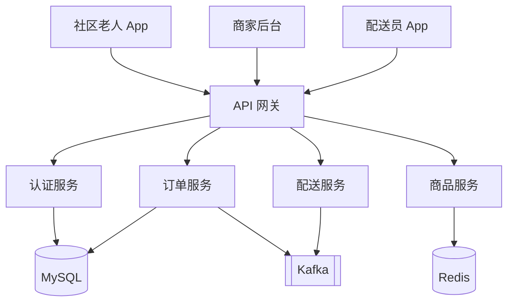
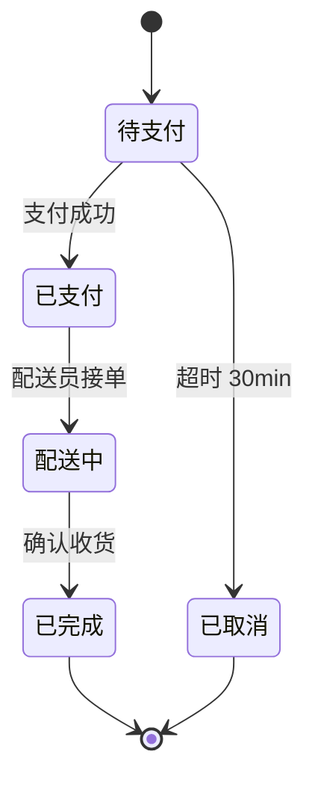

# 附录-示例项目示例集

> **定位**：产物层模板的示例库（示例项目目作为示范案例）
> **关系**：模板正文保持中性，所有具象示例抽离到本附录
> **使用方式**：先读 `02-产物层/01-05 阶段/*.md` 模板，再到本附录查对应示例

---

## 文档信息

| 项目 | 内容 |
|------|------|
| 示例项目 | 示例项目（社区电商 SaaS） |
| 用途 | 产物层各模板的具象示范 |
| 维护 | 模板升级时同步更新对应示例 |

---

## §1 需求阶段示例（跨阶段）

### 1.1 需求分析报告示例（D）

> 对应模板：[01-需求阶段/需求分析报告模板.md](./01-需求阶段/需求分析报告模板.md)

**项目**：示例项目社区电商

**干系人**：
| 角色 | 姓名 | 关注点 |
|------|------|--------|
| 项目发起人 | 王总 | GMV +15% |
| 业务负责人 | 李总 | 订单转化率 |
| 技术负责人 | 张工 | 可扩展性 |

**核心痛点**：
1. 老人不会用 App，社区团购流失
2. 商家管理后台复杂，操作门槛高
3. 配送最后一公里效率低

**需求清单（示例 5 条）**：
| ID | 需求 | 优先级 | 类型 |
|----|------|--------|------|
| R-001 | 大字体首页 + 一键下单 | P0 | 功能 |
| R-002 | 语音搜索商品 | P1 | 功能 |
| R-003 | 商家极简后台（5 步开店） | P0 | 功能 |
| R-004 | 配送员路径优化 | P1 | 功能 |
| R-005 | 数据看板（GMV/订单/转化） | P0 | 数据 |

### 1.2 PRD 示例（S）

> 对应模板：[01-需求阶段/PRD模板.md](./01-需求阶段/PRD模板.md)

**示例项目 PRD v1.0 - 节选 Part 4 用户角色**：

| 角色 | 描述 | 关键场景 |
|------|------|---------|
| 社区老人（C 端） | 50+ 岁，视力差 | 大字下单 / 语音搜索 |
| 商家（B 端） | 中小社区店主 | 极简开店 / 库存管理 |
| 配送员（D 端） | 最后一公里 | 路径规划 / 签收 |
| 运营（O 端） | 平台运营 | 数据看板 / 商家审核 |

**Part 7 模块设计 - 认证模块**：
- 登录：手机号 + 短信验证码（老人免密码）
- 注册：3 步（手机 → 验证 → 完成）
- 找回：短信验证 + 新密码
- 权限：C/B/D/O 四套角色

### 1.3 技术方案示例（D）

> 对应模板：[01-需求阶段/技术方案模板.md](./01-需求阶段/技术方案模板.md)

**示例项目技术方案 - 11 章节选**：

| 章节 | 内容要点 |
|------|---------|
| 1 项目概述 | 社区电商平台，服务 50+ 老人 + 中小商家 |
| 2 需求理解 | 5 条核心需求，P0=3 / P1=2 |
| 3 总体架构 | C4 Level 2 容器图（详见 §2.1） |
| 4 技术选型 | Spring Cloud Alibaba / Vue 3 / MySQL 8 / Redis 7 / Kafka |
| 5 数据库设计 | 订单库 + 商品库 + 用户库（分库分表） |
| 6 接口设计 | RESTful + OpenAPI 3.0，详见详设 §2.2 |
| 7 安全方案 | OAuth 2.0 + 短信验证码 + 风控规则引擎 |
| 8 性能方案 | P95 ≤ 500ms，DAU 10w，QPS 峰值 5k |
| 9 部署方案 | K8s + Helm，3 环境（dev/staging/prod） |
| 10 运维方案 | Prometheus + Grafana + ELK + 告警分级 |
| 11 风险评估 | 中间件成本高（Kafka 替代方案 RocketMQ） |

**关键技术决策（ADR）**：
- ADR-001：选用 Spring Cloud Alibaba 而非 Dubbo（生态完整 + 团队熟悉度）
- ADR-002：MySQL 分库分表 vs TiDB（成本优先选前者，规模超 100w QPS 再迁）
- ADR-003：认证用短信验证码为主（老人友好）+ 密码为辅

---

## §2 设计阶段示例（跨阶段）

### 2.1 架构设计示例（S）

> 对应模板：[02-设计阶段/架构设计模板.md](./02-设计阶段/架构设计模板.md)

**示例项目架构 - C4 Level 2 容器图**：



**关键技术决策（ADR）**：
| ID | 决策 | 选择 | 理由 |
|----|------|------|------|
| ADR-001 | 后端语言 | Java + Spring Boot | 团队熟悉 + 生态成熟 |
| ADR-002 | 数据库 | MySQL 8.0 | 事务一致性 |
| ADR-003 | 缓存 | Redis 7 | 高 QPS 商品查询 |
| ADR-004 | MQ | Kafka 3 | 订单异步解耦 |
| ADR-005 | 部署 | K8s | 弹性扩缩容 |

### 2.2 详细设计示例（S）

> 对应模板：[02-设计阶段/详细设计模板.md](./02-设计阶段/详细设计模板.md)

**示例项目下单接口**：

```yaml
openapi: 3.0.3
paths:
  /api/v1/orders:
    post:
      summary: 创建订单
      security:
        - BearerAuth: []
      requestBody:
        content:
          application/json:
            schema:
              type: object
              required: [productId, quantity, addressId]
              properties:
                productId: { type: integer, example: 1001 }
                quantity: { type: integer, minimum: 1, example: 2 }
                addressId: { type: integer, example: 88 }
      responses:
        '200':
          description: 创建成功
          content:
            application/json:
              schema:
                type: object
                properties:
                  orderId: { type: integer }
                  amount: { type: number }
                  status: { type: string, enum: [pending_payment] }
        '409': { description: 库存不足 }
```

**订单状态机**：


### 2.3 UI/UX 示例（跨阶段）

> 对应模板：[02-设计阶段/UI-UX设计规范模板.md](./02-设计阶段/UI-UX设计规范模板.md)

**示例项目 - 老人模式 Design Token（差异化）**：

```css
:root {
  /* 老人模式 - 字号放大 1.5x */
  --font-size-sm: 18px;   /* 默认 14px → 18px */
  --font-size-md: 24px;   /* 16px → 24px */
  --font-size-lg: 32px;   /* 18px → 32px */

  /* 老人模式 - 间距放大 */
  --space-md: 24px;       /* 16 → 24 */
  --space-lg: 32px;       /* 24 → 32 */

  /* 老人模式 - 对比度增强 */
  --color-text-primary: rgba(0,0,0,0.95);  /* 0.88 → 0.95 */
}
```

**关键交互**：
- 下单按钮：高 64px（默认 40px）
- 字号最小 18px（默认 14px）
- 语音搜索图标常驻首页右上角

---

## §3 开发阶段示例（开发阶段）

> 对应模板：[03-开发阶段/代码工程化规范.md](./03-开发阶段/代码工程化规范.md)

**示例项目 - atomic commit 示例**：

```bash
git commit -m "feat(order): 添加下单接口，支持库存校验

响应 PRD Part 7 订单模块 R-001。库存校验用 Redis 原子减库存
防止超卖。下单失败时事务回滚 + 库存回补。
单测覆盖：正常下单/库存不足/并发下单/地址无效（4 用例，覆盖率 95%）。

Refs: PRD-PYSH-2026-001 Part 7"
```

**示例项目 - 单测示例（订单服务）**：

```typescript
describe('createOrder', () => {
  it('库存充足应创建订单并扣减库存', async () => {
    const result = await createOrder({ productId: 1001, quantity: 2, addressId: 88 });
    expect(result.orderId).toBeDefined();
    expect(result.status).toBe('pending_payment');
    const stock = await getStock(1001);
    expect(stock).toBe(/* 原库存 - 2 */);
  });

  it('库存不足应抛 BizError', async () => {
    await expect(createOrder({ productId: 1001, quantity: 9999, addressId: 88 }))
      .rejects.toThrow(BizError);
  });
});
```

---

## §4 测试阶段示例（交付阶段测试）

> 对应模板：[04-测试阶段/质量标准与验收模板.md](./04-测试阶段/质量标准与验收模板.md)

**示例项目 - 测试用例示例（边界值法）**：

| 用例 ID | 模块 | 标题 | 优先级 | 设计方法 | 预期 |
|---------|------|------|--------|---------|------|
| TC-ORDER-001 | 订单 | 单笔下单数量 1（min） | P0 | 边界值 | 成功 |
| TC-ORDER-002 | 订单 | 单笔下单数量 99 | P1 | 边界值 | 成功 |
| TC-ORDER-003 | 订单 | 单笔下单数量 100（max） | P0 | 边界值 | 成功 |
| TC-ORDER-004 | 订单 | 单笔下单数量 101（超上限） | P0 | 边界值 | 拒绝 |
| TC-ORDER-005 | 订单 | 单笔下单数量 0（无效） | P0 | 边界值 | 拒绝 |

**示例项目 - 性能基线**：
| 接口 | P95 目标 | 实际 | 结果 |
|------|---------|------|------|
| 商品查询 | ≤ 100ms | 78ms | Pass |
| 下单 | ≤ 300ms | 245ms | Pass |
| 支付 | ≤ 500ms | 412ms | Pass |

---

## §5 交付阶段示例（交付阶段 部署验收）

> 对应模板：[05-交付阶段/部署与验收文档模板.md](./05-交付阶段/部署与验收文档模板.md)

**示例项目 - 部署 Checkpoint 示例**：

```bash
# 部署前快照
./snapshot.sh --type deploy --node Ship --tag pre-deploy-pysh-20260715

# 输出
# ✓ Snapshot created: snapshots/pre-deploy-pysh-20260715-1430/
#   - DB dump: pysh-db.sql (380MB)
#   - Config: pysh-config.tar.gz (18KB)
#   - AI context: pysh-ai-context.json (52KB)
#   - sha256: b2c3d4...
```

**示例项目 - 验收结论**：
- 功能性：100% 通过（48/48 用例）
- 性能：3 接口全部达标
- 安全：OWASP Top 10 = 0
- 客户签字：王总 2026-07-20

---

## §6 管理阶段示例（贯穿）

> 对应模板：[06-管理阶段/项目管理产物模板.md](./06-管理阶段/项目管理产物模板.md)

**示例项目 - WBS（节选）**：

| WBS ID | 任务 | 估算（人天） | 负责 |
|--------|------|------------|------|
| 1.1 | 需求调研 | 8 | 李产品 |
| 2.1 | 架构设计 | 6 | 张架构 |
| 3.1 | C 端开发 | 25 | 王前端 + 赵后端 |
| 3.2 | B 端开发 | 20 | 王前端 + 赵后端 |
| 3.3 | D 端开发 | 12 | 王前端 + 赵后端 |

**示例项目 - 风险登记册（节选）**：
| 风险 | 概率 | 影响 | 等级 | 响应 |
|------|------|------|------|------|
| 老人模式 UI 反复 | 高 | 中 | R2 | 原型测试 + 早期客户反馈 |
| 第三方支付对接延期 | 中 | 高 | R2 | 提前 2 周启动对接 |

---

## 版本记录

| 版本 | 日期 | 修订内容 |
|------|------|---------|
| V1.0 | 2026-06-30 | 从模板正文抽离示例项目示例，建立独立示例库 |
| V1.1 | 2026-07-06 | 全仓一致性复盘 + 五角色/新 schema 对齐 |

---

*本附录是「产物层模板」的示例参考。模板保持中性，示例集中在本文件。*
