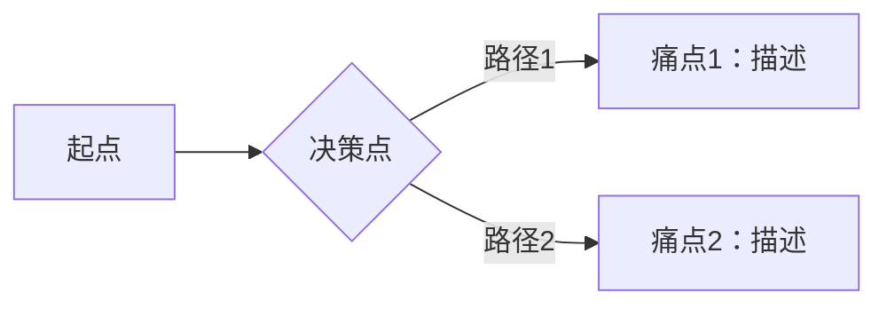

# 需求分析报告模板

> **阶段**：需求阶段需求分析
> **主责智能体**：pre-sales-copilot
> **QG**：QG-需求（详见 [01-标准层/03-质量门禁QG-需求至QG-交付.md](../01-标准层/03-质量门禁QG-需求至QG-交付.md) §二）
> **示例参考**：[附录-示例项目示例集.md](./附录-示例项目示例集.md) §1.1

---

## 文档信息

| 项目 | 内容 |
|------|------|
| 项目名称 | {填写} |
| 文档编号 | {NAR-{项目缩写}-2026-001} |
| 文档版本 | V1.0 |
| 编写日期 | {YYYY-MM-DD} |
| 编写人 | {姓名/角色} |
| 评审状态 | 待评审 / 已评审 / 已通过 |

### 修订记录

| 版本 | 日期 | 修订人 | 修订内容 | 交接契约引用 |
|------|------|--------|---------|---------------|
| V1.0 | {date} | {name} | 初始版本 | D/iter 1 |

---

## 正文

### 一、项目概述

#### 1.1 项目背景

{描述项目产生背景、业务痛点、市场机会。200-500 字。}

#### 1.2 业务目标（必须可量化）

| 目标 | 指标 | 衡量方式 | 时间窗 |
|------|------|---------|--------|
| {例：用户增长} | {5 万注册} | {数据库统计} | {6 个月} |
| {例：交易规模} | {月均 100 万} | {财务报表} | {稳定期} |

> ⚠ 业务目标 100% 可量化（QG-需求.2 硬阻塞）。

#### 1.3 项目定位

{一句话定位 + 目标用户 + 核心价值}

---

### 二、干系人分析

#### 2.1 干系人清单

| 干系人角色 | 姓名/部门 | 关注点 | 影响力 | 参与度 |
|-----------|---------|--------|--------|--------|
| 业务发起人 | {填写} | {ROI} | 高 | 高 |
| 终端用户 | {填写} | {体验} | 高 | 中 |
| 技术团队 | {填写} | {可行性} | 中 | 高 |

#### 2.2 沟通计划

| 沟通形式 | 频率 | 参与人 | 产物 |
|---------|------|--------|------|
| 周会 | 每周 | 项目组 | 周报 |
| 评审会 | 阶段末 | 干系人 | 评审纪要 |

---

### 三、业务流程分析

#### 3.1 当前流程（As-Is）

{描述现状业务流程，含痛点。建议附 Mermaid flowchart。}

#### 3.2 目标流程（To-Be）

{描述改造后流程，含改进点。}

#### 3.3 痛点分层

| # | 痛点 | 影响范围 | 严重度 | 根因 |
|---|------|---------|--------|------|
| 1 | {填写} | {部门/角色} | 高/中/低 | {填写} |

---

### 四、用户角色矩阵

#### 4.1 角色定义

| 角色 | 描述 | 权限范围 | 典型场景 |
|------|------|---------|---------|
| {管理员} | {全权} | {所有模块} | {运营管理} |
| {普通用户} | {受限} | {自助操作} | {日常使用} |

#### 4.2 角色 × 功能矩阵

| 功能 \ 角色 | 管理员 | 普通用户 | 游客 |
|------------|--------|---------|------|
| 查看 | ✅ | ✅ | ✅ |
| 创建 | ✅ | ✅ | ❌ |
| 删除 | ✅ | ❌ | ❌ |

---

### 五、需求清单（按优先级）

#### 5.1 优先级矩阵

| 优先级 | 定义 | 占比目标 |
|--------|------|---------|
| P0 | 必须有（MVP） | ~40% |
| P1 | 应该有（一期） | ~35% |
| P2 | 可以有（二期） | ~25% |

#### 5.2 功能清单总表

| # | 模块 | 功能点 | 优先级 | 来源 | 验收标准 |
|---|------|--------|--------|------|---------|
| 1 | {模块名} | {功能描述} | P0 | {客户/竞品/合规} | {可测试的验收条件} |

#### 5.3 非功能需求

| 类别 | 需求 | 指标 |
|------|------|------|
| 性能 | 响应时间 | P95 ≤ 200ms |
| 可用性 | SLA | ≥ 99.5% |
| 安全 | 鉴权 | 敏感接口 100% |
| 合规 | 数据保护 | {按行业} |

---

### 六、场景覆盖

#### 6.1 主要场景清单

| # | 场景 | 主角色 | 触发条件 | 期望结果 | 优先级 |
|---|------|--------|---------|---------|--------|
| 1 | {场景名} | {角色} | {条件} | {结果} | P0 |

> ⚠ 主要场景覆盖 ≥ 95%（QG-需求.4）。

#### 6.2 边界场景

{列出异常/边界场景。如：网络中断、并发冲突、空数据等。}

---

### 七、风险识别

| # | 风险 | 类别 | 严重度 | 概率 | 应对 |
|---|------|------|--------|------|------|
| 1 | {填写} | 技术/合规/资源 | 高/中/低 | 高/中/低 | {缓解方案} |

---

### 八、竞品分析（可选）

| 维度 | 我方 | 竞品 A | 竞品 B | 启示 |
|------|------|--------|--------|------|
| 功能完整度 | {填写} | {填写} | {填写} | {策略} |
| 用户体验 | {填写} | {填写} | {填写} | {策略} |
| 商业模式 | {填写} | {填写} | {填写} | {策略} |

---

## 验收标准

本产物通过 QG-需求 部分检查项：

| 检查项 | 通过标准 | 实际 | 状态 |
|--------|---------|------|------|
| QG-需求.1 需求分析报告完整性 | 5 维全绿 | {填写} | ☐ |
| QG-需求.2 业务目标可量化 | 100% 可量化 | {填写} | ☐ |
| QG-需求.4 场景覆盖率 | ≥ 95% | {填写} | ☐ |
| QG-需求.8 二义性检测 | LLM 分 ≤ 0.2 | {填写} | ☐ |
| QG-需求.9 风险清单 | 风险识别完整 | {填写} | ☐ |

完整 QG-需求 checklist 见 [01-标准层/03-质量门禁QG-需求至QG-交付.md](../01-标准层/03-质量门禁QG-需求至QG-交付.md) §二。

---

## 版本记录

| 版本 | 日期 | 触发原因 | 主要 diff | 交接契约引用 |
|------|------|---------|----------|---------------|
| V1.0 | {date} | 初稿 | — | D/iter 1 |
| V1.1 | {date} | 评审反馈 | {简述} | D/iter 2 |
| V2.0 | {date} | S 架构反馈 | {简述} | D/iter 3 |

---

*本模板是「需求分析报告」的标准结构。示例项目完整示例见 [附录-示例项目示例集.md](./附录-示例项目示例集.md) §1.1。*
