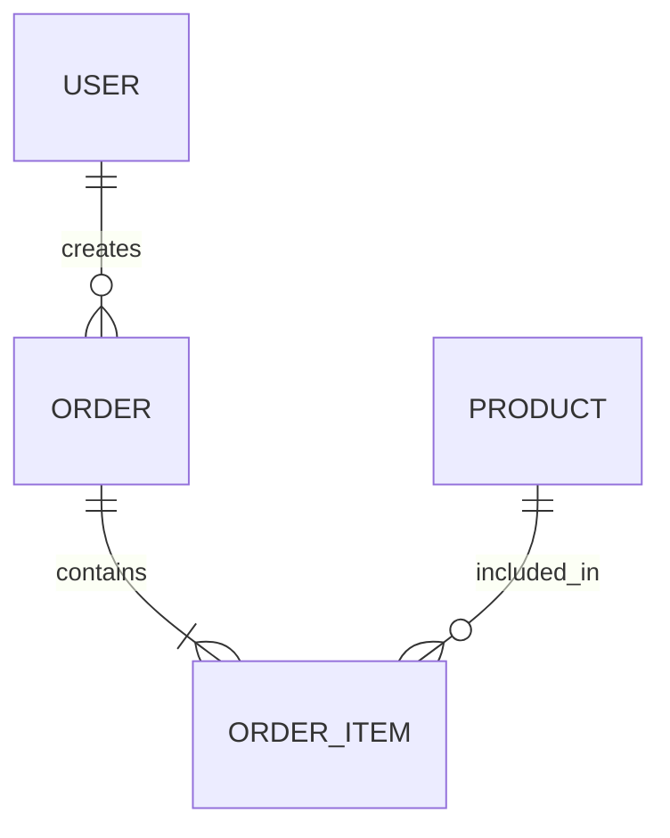
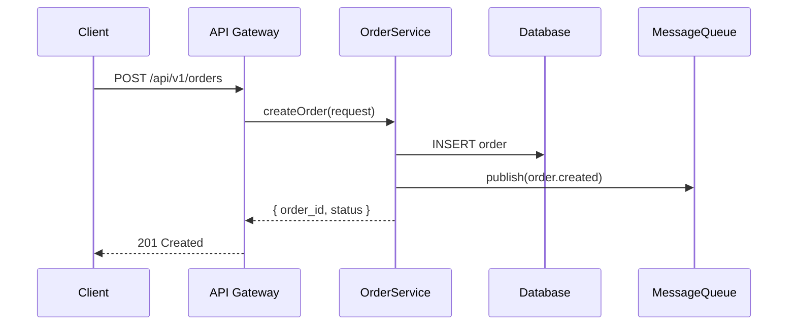

# 详细设计工作流

> 本文件描述详细设计的完整流程。核心依赖 detailed-designer 已安装时调用其技能，否则使用本文件内置流程。

## 依赖技能

| 技能 | 用途 | 降级 |
|------|------|------|
| `detailed-designer` | 详细设计主技能 | 本文件内置流程 |
| `architecture-designer` | 前置，提供架构设计输入 | 通过架构文档补充 |
| `api-doc-generator` | 接口文档自动生成 | 手动编写 Markdown |

---

## 工作流步骤

### Stage 1：模块拆解

**输入**：
- 架构设计文档（来自 architecture-workflow）
- PRD 文档（Part 7 功能模块详细说明）

**动作**：
1. 将架构模块拆分为可实现的子模块/服务/类
2. 每个子模块定义：
   - 名称与职责
   - 对外提供的功能
   - 依赖的其他子模块
   - 核心类/函数清单
3. 拆分粒度原则：
   - 每个子模块可由 1 名开发者独立完成
   - 接口清晰，内部实现可独立变更
   - 可独立测试

**输出**：模块拆解表

| 子模块 | 职责 | 对外功能 | 依赖 | 预估复杂度 |
|--------|------|---------|------|-----------|
| ... | ... | ... | ... | 低/中/高 |

---

### Stage 2：接口设计

**输入**：Stage 1 模块拆解表 + PRD Part 9（接口规范）

**动作**：为每个子模块定义对外接口

#### 接口定义模板

```
接口名称：{verb} {path}
描述：{一句话说明接口用途}
方法：GET / POST / PUT / DELETE / PATCH
路径参数：{param_name} ({type}) - {说明}
查询参数：{param_name} ({type}, {required/optional}) - {说明}
请求体：
  {
    "field_name": {type} // {说明}
  }
响应体：
  200 成功：
  {
    "field_name": {type} // {说明}
  }
  400 参数错误：
  {
    "error_code": "40001",
    "message": "{错误描述}"
  }
鉴权：{是否需要} ({方式})
限流：{是否需要} ({限制})
```

#### 接口设计原则

- RESTful 风格为主，GraphQL 按需
- 统一错误码体系（范围分配）
- 版本控制（URL 路径或 Header）
- 分页、排序、筛选统一规范

**输出**：接口清单（每个子模块的接口列表）

---

### Stage 3：数据模型

**输入**：Stage 2 接口清单 + PRD Part 8（数据模型）

**动作**：

#### 3.1 数据库表设计

每张表定义：
- 表名（遵循命名规范）
- 字段清单（字段名/类型/约束/默认值/说明）
- 主键策略（自增/UUID/雪花算法）
- 索引策略（主键索引/唯一索引/联合索引/查询优化索引）
- 分表策略（如需要）

#### 3.2 ER 图

使用 Mermaid erDiagram 绘制实体关系图：



#### 3.3 数据字典

统一枚举值、状态码、类型码的定义：

| 枚举类型 | 值 | 说明 |
|---------|-----|------|
| OrderStatus | 10 | 待支付 |
| OrderStatus | 20 | 已支付 |
| OrderStatus | 30 | 已发货 |

**输出**：DDL 脚本 + ER 图 + 数据字典

---

### Stage 4：时序图

**输入**：Stage 2 接口清单 + Stage 3 数据模型

**动作**：为 P0 核心业务流程绘制时序图

使用 Mermaid sequenceDiagram：



**覆盖范围**：
- 所有 P0 功能的核心流程
- 关键异常流程（支付失败、库存不足等）
- 跨模块交互流程

**输出**：时序图集合

---

### Stage 5：文档输出

**输出**：详细设计文档

#### 文档模板

```markdown
# {项目名称} 详细设计文档

## 1. 文档信息
- 版本 / 作者 / 审核 / 日期

## 2. 模块概览
- 模块拆解表
- 模块依赖关系图

## 3. 接口设计
- 3.1 接口总览（接口清单表）
- 3.2 接口详细定义（每个接口按模板）
- 3.3 错误码定义
- 3.4 鉴权与权限

## 4. 数据模型
- 4.1 数据库表设计（DDL + 字段说明）
- 4.2 ER 图
- 4.3 索引策略
- 4.4 数据字典（枚举/状态码/类型码）

## 5. 时序图
- 核心业务流程时序图集合

## 6. 非功能性设计补充
- 缓存策略
- 并发控制
- 数据一致性方案

## 附录
- 接口变更记录
- 数据库迁移策略
```

---

### Stage 6：后续衔接

**产出完成后，向用户建议可选的后续步骤**：

| 后续动作 | 工作流/技能 | 说明 |
|----------|-----------|------|
| 进入编码 | coding-workflow | 基于详细设计开始编码 |
| 生成接口文档 | api-doc-generator | 自动生成 OpenAPI/Swagger |
| 数据库建模 | 日常路由 | 生成完整 DDL + 初始化脚本 |

**交接准备**：
- 详细设计文档归档到 `项目文档/{项目名}/详细设计文档.md`
- DDL 脚本归档到 `项目文档/{项目名}/数据库/`
- 接口文档归档到 `项目文档/{项目名}/接口文档/`

---

## 决策速查

```
用户要做详细设计
  ├─ 有架构文档 → 从架构文档提取模块 → 进入 Stage 1
  ├─ 无架构文档 → 先做架构设计（architecture-workflow）
  └─ 只需部分模块 → 澄清范围 → 针对指定模块进入 Stage 2

接口设计：
  ├─ RESTful（默认）→ CRUD 操作 + 标准资源路径
  ├─ GraphQL → 复杂查询 + 多端适配
  └─ gRPC → 内部服务间通信

数据模型：
  ├─ 关系型（默认）→ MySQL/PostgreSQL
  ├─ NoSQL → 文档/键值/搜索
  └─ 混合 → 关系型主存储 + NoSQL 辅助
```
