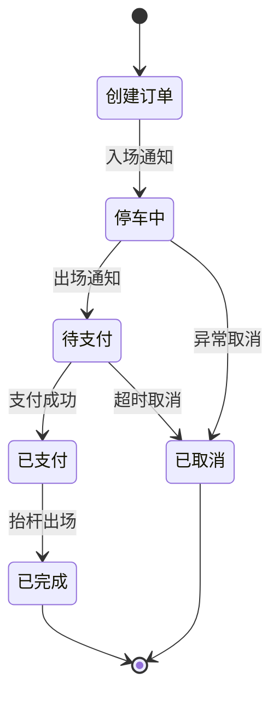
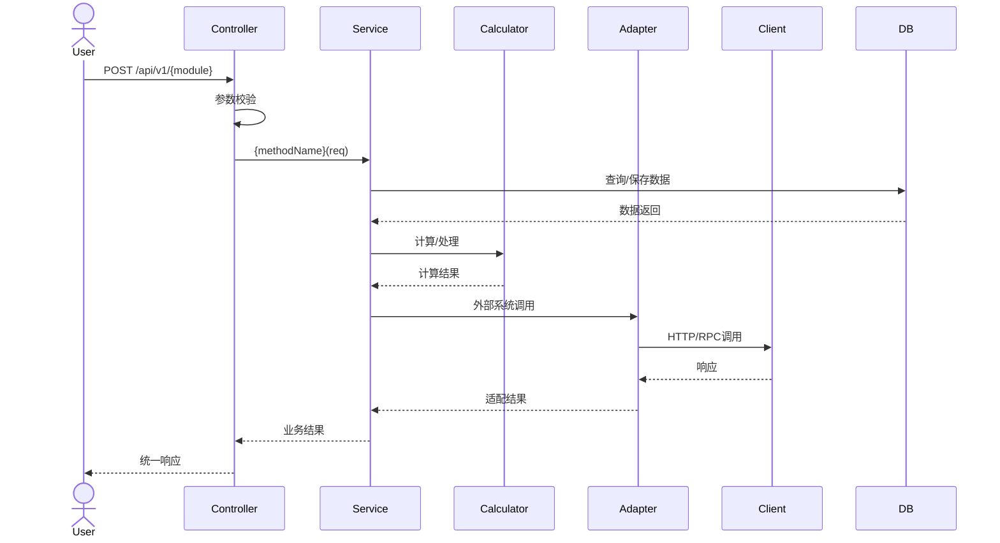

# 详细设计模板与方法论

> 版本：V1.0 | 适用技能：detailed-designer | 编写日期：2026-05-28
> 来源：飞书知识库「详细设计-完整模板」（蒲阳生活停车业务模块示例）

---

## 一、10 章详细设计标准结构

| 章节 | 内容要点 | 输出形式 |
|------|---------|---------|
| 第一部分：文档信息 | 模块名称/编号/版本/日期/编写人 | 表格 |
| 第二部分：模块概述 | 职责描述、核心功能、依赖关系、边界 | 文字 + 依赖图 |
| 第三部分：类与接口设计 | 核心类图（属性+方法）、接口契约 | Mermaid classDiagram |
| 第四部分：接口定义 | RESTful API（URL/方法/参数/响应/错误码） | 表格 + OpenAPI |
| 第五部分：数据库设计 | DDL（字段+索引+约束）、ER关系 | 表格 + SQL |
| 第六部分：业务流程设计 | 核心流程时序图、状态流转图 | Mermaid sequenceDiagram / stateDiagram |
| 第七部分：第三方对接设计 | 接口清单、签名机制、异常处理 | 表格 + 代码 |
| 第八部分：缓存设计 | Key 格式/类型/TTL/更新策略 | 表格 |
| 第九部分：性能设计 | 指标量化（响应时间/并发/吞吐）+ 实现方案 | 表格 |
| 第十部分：验收标准 | 接口/流程/数据/性能/安全/对接验收项 | 表格 |

---

## 二、核心类设计模板（五层架构）

详细设计采用 Controller → Service → Calculator/Processor → Adapter → Client 五层架构：

```
┌─────────────────────────────────────────────────────────┐
│  Controller 层                                           │
│  职责：接收请求、参数校验、调用 Service、返回统一响应        │
│  原则：不含业务逻辑，只做路由和数据转换                       │
├─────────────────────────────────────────────────────────┤
│  Service 层                                              │
│  职责：核心业务逻辑编排、事务管理、异常处理                    │
│  注入：Repository + Calculator + Adapter + Client          │
├─────────────────────────────────────────────────────────┤
│  Calculator / Processor 层                               │
│  职责：纯计算/纯处理逻辑（费用计算、规则匹配、数据转换）       │
│  特点：无状态、可单元测试、可独立复用                         │
├─────────────────────────────────────────────────────────┤
│  Adapter 层                                              │
│  职责：外部系统适配（协议转换、数据映射、降级处理）            │
│  特点：隔离外部依赖，内部系统不直接依赖外部接口                │
├─────────────────────────────────────────────────────────┤
│  Client 层                                               │
│  职责：远程服务调用（HTTP/RPC/MQ），封装通信细节              │
│  特点：超时控制、重试机制、熔断降级                          │
└─────────────────────────────────────────────────────────┘
```

### 类描述模板

```markdown
### {ClassName}

**职责**：{一句话描述}

**属性**：

| 属性名 | 类型 | 说明 |
|--------|------|------|
| {name} | {Type} | {说明} |

**方法**：

| 方法签名 | 说明 | 返回值 | 异常 |
|---------|------|--------|------|
| {method}({params}) | {说明} | {Type} | {Exception} |
```

### 蒲阳停车模块类设计示例

| 类名 | 层级 | 核心方法 |
|------|------|---------|
| ParkingController | Controller | queryLots / getLotDetail / createOrder / calculateFee / payOrder / handleExit / queryOrders |
| ParkingService | Service | queryNearbyLots / createParkingOrder / calculateFee / processPayment / notifyExit |
| FeeCalculator | Calculator | calcBaseFee / calcDiscount / calcMemberFee / calcTotalFee |
| ParkingAdapter | Adapter | syncLotInfo / notifyEntry / notifyExit / queryFee / sendPayResult |
| PaymentClient | Client | createPayment / queryPayment / refund |

---

## 三、API 接口定义模板

### 3.1 接口定义标准格式

```markdown
### {接口名称} - {METHOD} {URL}

**请求参数**：

| 参数名 | 类型 | 必填 | 说明 |
|--------|------|------|------|
| {name} | {type} | 是/否 | {说明} |

**响应格式**：

| 字段名 | 类型 | 说明 |
|--------|------|------|
| code | int | 状态码（0成功） |
| msg | string | 状态描述 |
| data | {Type} | 业务数据 |
| timestamp | long | 时间戳 |

**错误码**：

| 错误码 | 说明 |
|--------|------|
| 0 | 成功 |
| 1001 | 参数校验失败 |
| 2001 | 业务异常 |
| 3001 | 权限不足 |
| 5001 | 系统异常 |
```

### 3.2 接口命名规范

- URL 前缀：`/api/v1/{模块}/`
- 查询列表：`GET /api/v1/{模块}/{资源}` （复数）
- 查询详情：`GET /api/v1/{模块}/{资源}/{id}`
- 创建：`POST /api/v1/{模块}/{资源}`
- 更新：`PUT /api/v1/{模块}/{资源}/{id}`
- 删除：`DELETE /api/v1/{模块}/{资源}/{id}`
- 操作类：`POST /api/v1/{模块}/{资源}/{id}/{动作}`

### 3.3 统一响应格式

```json
{
  "code": 0,
  "msg": "success",
  "data": {},
  "timestamp": 1714281600000
}
```

分页响应：

```json
{
  "code": 0,
  "msg": "success",
  "data": {
    "records": [],
    "total": 100,
    "pageNum": 1,
    "pageSize": 10
  }
}
```

---

## 四、数据库设计模板

### 4.1 字段表模板

```markdown
### {表名} {表说明}

| 字段名 | 类型 | 必填 | 说明 |
|--------|------|------|------|
| id | bigint | 是 | 主键，自增 |
| {字段名} | {类型} | 是/否 | {说明} |
| created_by | bigint | 是 | 创建人 |
| created_at | datetime | 是 | 创建时间 |
| updated_by | bigint | 是 | 更新人 |
| updated_at | datetime | 是 | 更新时间 |
| deleted | tinyint | 是 | 逻辑删除：0正常 1删除 |
| remark | varchar(500) | 否 | 备注 |
```

### 4.2 基础字段规范

每张表必须包含以下基础字段：

| 字段 | 类型 | 说明 |
|------|------|------|
| id | bigint | 主键，自增 |
| created_by | bigint | 创建人 ID |
| created_at | datetime | 创建时间 |
| updated_by | bigint | 更新人 ID |
| updated_at | datetime | 更新时间 |
| deleted | tinyint | 逻辑删除标记（0正常/1删除） |
| remark | varchar(500) | 备注 |

### 4.3 索引设计模板

```markdown
| 索引名 | 字段 | 类型 | 说明 |
|--------|------|------|------|
| PRIMARY | id | 主键 | - |
| uk_{字段} | {字段} | 唯一 | 防重复 |
| idx_{表名}_{字段} | {字段} | 普通 | 按字段查询 |
| idx_{表名}_{字段1}_{字段2} | {字段1},{字段2} | 组合 | 联合查询 |
```

### 4.4 命名规范

| 对象 | 规范 | 示例 |
|------|------|------|
| 表名 | `{模块}_{实体}` | t_order_parking / t_member_user |
| 字段名 | snake_case | order_no / created_at |
| 索引名 | `idx_{表名}_{字段}` / `uk_{字段}` | idx_order_parking_user_id |
| 状态字段 | `{名称}_status` | pay_status / order_status |

### 4.5 停车订单表完整示例（DDL）

```sql
CREATE TABLE t_order_parking (
    id              BIGINT          NOT NULL AUTO_INCREMENT COMMENT '主键',
    order_no        VARCHAR(32)     NOT NULL COMMENT '订单编号',
    user_id         BIGINT          NULL COMMENT '用户ID',
    lot_id          VARCHAR(32)     NOT NULL COMMENT '停车场ID',
    lot_code        VARCHAR(32)     NOT NULL COMMENT '停车场编码(厂家)',
    lot_name        VARCHAR(100)    NOT NULL COMMENT '停车场名称',
    plate_no        VARCHAR(10)     NOT NULL COMMENT '车牌号',
    vehicle_type    TINYINT         NULL DEFAULT 1 COMMENT '车辆类型：1小型 2中型 3大型',
    entry_time      DATETIME        NOT NULL COMMENT '入场时间',
    exit_time       DATETIME        NULL COMMENT '出场时间',
    duration        INT             NULL COMMENT '停车时长(分钟)',
    base_fee        DECIMAL(10,2)   NOT NULL DEFAULT 0.00 COMMENT '基础费用',
    member_discount DECIMAL(3,2)    NOT NULL DEFAULT 1.00 COMMENT '会员折扣率',
    member_fee      DECIMAL(10,2)   NOT NULL DEFAULT 0.00 COMMENT '会员优惠金额',
    coupon_id       BIGINT          NULL COMMENT '优惠券ID',
    coupon_fee      DECIMAL(10,2)   NOT NULL DEFAULT 0.00 COMMENT '优惠券抵扣金额',
    total_fee       DECIMAL(10,2)   NOT NULL DEFAULT 0.00 COMMENT '应付金额',
    discount_fee    DECIMAL(10,2)   NOT NULL DEFAULT 0.00 COMMENT '优惠金额合计',
    actual_fee      DECIMAL(10,2)   NOT NULL DEFAULT 0.00 COMMENT '实付金额',
    pay_type        TINYINT         NULL COMMENT '支付方式：1微信 2余额 3混合',
    pay_balance     DECIMAL(10,2)   NULL DEFAULT 0.00 COMMENT '余额支付金额',
    pay_wx          DECIMAL(10,2)   NULL DEFAULT 0.00 COMMENT '微信支付金额',
    pay_time        DATETIME        NULL COMMENT '支付时间',
    pay_status      TINYINT         NOT NULL DEFAULT 0 COMMENT '支付状态：0未支付 1已支付 2支付中 3已退款 4支付失败',
    status          TINYINT         NOT NULL DEFAULT 1 COMMENT '订单状态：1停车中 2已完成 3已取消',
    exit_type       TINYINT         NULL COMMENT '出场方式：1自动抬杆 2人工放行',
    entry_image     VARCHAR(500)    NULL COMMENT '入场图片URL',
    exit_image      VARCHAR(500)    NULL COMMENT '出场图片URL',
    created_at      DATETIME        NOT NULL DEFAULT CURRENT_TIMESTAMP,
    updated_at      DATETIME        NOT NULL DEFAULT CURRENT_TIMESTAMP ON UPDATE CURRENT_TIMESTAMP,
    PRIMARY KEY (id),
    UNIQUE KEY uk_order_no (order_no),
    KEY idx_user_id (user_id),
    KEY idx_plate_no (plate_no),
    KEY idx_lot_id (lot_id),
    KEY idx_entry_time (entry_time),
    KEY idx_status (status),
    KEY idx_lot_plate (lot_id, plate_no, status)
) ENGINE=InnoDB DEFAULT CHARSET=utf8mb4 COMMENT='停车订单表';
```

---

## 五、状态流转图设计

### 5.1 状态机 Mermaid 模板



### 5.2 状态字段设计规范

| 规范项 | 要求 |
|--------|------|
| 字段类型 | tinyint（1-255 个状态值） |
| 字段命名 | `{业务}_status` |
| 值定义 | 必须在注释中列出所有值和含义 |
| 初始值 | 明确默认状态 |
| 终态 | 至少一个正常终态 + 一个异常终态 |

### 5.3 蒲阳停车订单状态定义

| 状态值 | 名称 | 说明 |
|--------|------|------|
| 1 | 停车中 | 车辆已入场，正在计费 |
| 2 | 已完成 | 支付成功，已出场 |
| 3 | 已取消 | 异常或超时取消 |

支付状态：

| 状态值 | 名称 | 说明 |
|--------|------|------|
| 0 | 未支付 | 初始状态 |
| 1 | 已支付 | 支付成功 |
| 2 | 支付中 | 正在支付 |
| 3 | 已退款 | 已退款 |
| 4 | 支付失败 | 支付失败 |

---

## 六、时序图模板（Mermaid）

### 6.1 标准时序图结构



### 6.2 时序图设计要点

1. **覆盖核心流程**：每个模块至少绘制 1 个主流程时序图
2. **标注异常分支**：用 `alt` / `opt` 标注异常路径
3. **标注缓存**：Redis 缓存命中/未命中路径
4. **标注异步**：MQ 异步处理场景
5. **标注事务边界**：`@Transactional` 作用范围

---

## 七、第三方对接设计模板

### 7.1 接口清单模板

| 接口 | 方向 | 用途 | 调用时机 |
|------|------|------|---------|
| {URL} | 平台→外部/外部→平台 | {说明} | {触发条件} |

### 7.2 签名机制模板

```
签名算法：MD5(所有参数按key升序拼接 + timestamp + secretKey)
示例：MD5("amount=100&orderId=xxx&timestamp=1714281600&key=secretKey")
请求头携带：
  X-Timestamp: 请求时间戳（秒）
  X-Sign: 签名值
```

### 7.3 异常处理矩阵

| 异常场景 | 处理策略 | 重试机制 |
|---------|---------|---------|
| 外部系统超时 | 返回降级数据或错误提示 | 重试3次，间隔5秒 |
| 外部系统不可用 | 记录日志，降级为离线模式 | 定时重试（1分钟间隔） |
| 签名校验失败 | 拒绝请求，记录异常IP | 不重试 |
| 数据格式异常 | 记录原始数据，告警通知 | 不重试 |

---

## 八、缓存设计模板

| 数据 | Key 格式 | 类型 | TTL | 更新策略 |
|------|---------|------|-----|---------|
| {数据描述} | `{模块}:{实体}:{标识}` | String/Hash/List/Set/ZSet | {时间} | {策略} |

**更新策略选项**：
- **定时同步**：后台任务定时刷新
- **实时同步**：数据变更时立即更新
- **变更更新**：监听变更事件触发更新
- **TTL 过期**：依赖 TTL 自动过期重新加载
- **入场创建/出场删除**：生命周期管理

### 蒲阳停车缓存设计示例

| 数据 | Key | 类型 | TTL | 更新策略 |
|------|-----|------|-----|---------|
| 停车场信息 | `parking:lot:{lotId}` | Hash | 1小时 | 定时同步 |
| 空余车位 | `parking:space:{lotId}` | String | 30秒 | 实时同步 |
| 用户车辆 | `parking:vehicle:{userId}` | List | 1天 | 变更更新 |
| 停车订单 | `parking:order:{orderNo}` | Hash | 1小时 | 变更更新 |
| 停车中订单 | `parking:active:{plateNo}:{lotId}` | String | 无 | 入场创建/出场删除 |

---

## 九、性能设计模板

| 指标 | 要求 | 实现方案 |
|------|------|---------|
| {接口/场景} | {量化指标} | {技术方案} |

### 蒲阳停车性能设计示例

| 指标 | 要求 | 实现方案 |
|------|------|---------|
| 停车场列表查询 | <500ms | Redis 缓存 + 地理索引（GEORADIUS） |
| 费用计算 | <100ms | 内存计算 + 规则缓存 |
| 支付接口 | <2s | 异步化 + 并行调用厂家系统 |
| 入场通知处理 | <1s | MQ 异步处理，削峰填谷 |
| 并发支付 | 支持 100 QPS | 分布式锁 + 幂等校验 |

---

## 十、详细设计工作流

### 核心流程

```
1. 模块拆解  → 确认模块边界和职责
2. 类图设计  → 定义核心类的属性和方法
3. 接口定义  → 定义 RESTful API（输入/输出/错误码）
4. 数据模型  → 设计 DDL（字段/索引/约束）
5. 时序图    → 绘制核心业务流程时序图
6. 状态机    → 绘制有状态业务的状态流转图
7. 第三方对接 → 定义外部系统接口和异常处理
8. 缓存设计  → 定义缓存 Key/TTL/更新策略
9. 性能设计  → 量化性能指标和实现方案
10. 文档输出 → 组装 10 章详细设计文档
```

### 质量检查清单

| 检查项 | 通过标准 |
|--------|---------|
| 接口覆盖 | 每个功能点至少对应 1 个 API |
| 状态完整 | 状态机覆盖所有合法路径 + 异常路径 |
| 异常覆盖 | 每个接口定义至少 2 种异常响应 |
| 数据一致 | DDL 与接口字段对应，无遗漏 |
| 缓存合理 | 热点数据有缓存，TTL 合理 |
| 性能量化 | 每个指标有数值要求和实现方案 |
| 第三方隔离 | 外部调用通过 Adapter 隔离 |
| 金额规范 | 金额字段 decimal(10,2) 或 Long（分） |

---

## 版本记录

| 版本 | 日期 | 变更说明 |
|------|------|---------|
| V1.0 | 2026-05-28 | 初始版本，含完整停车模块示例 |
