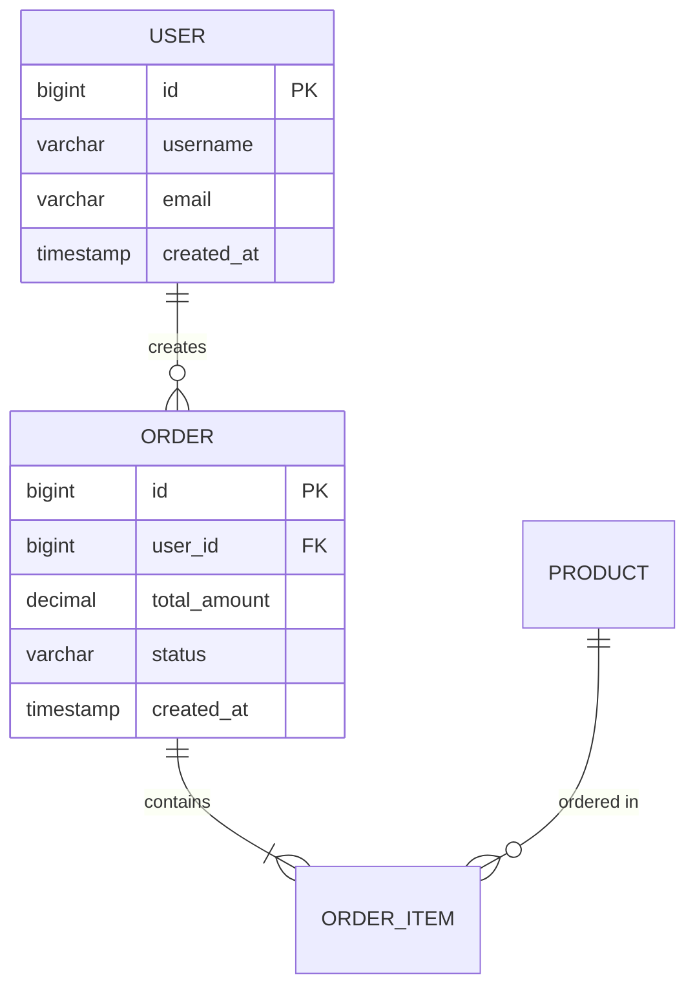
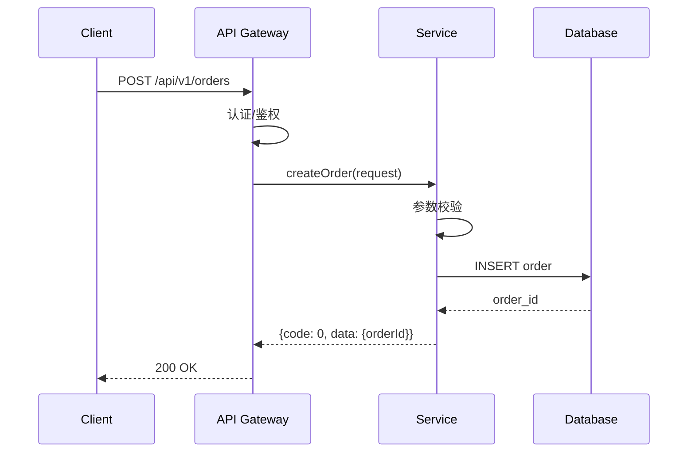
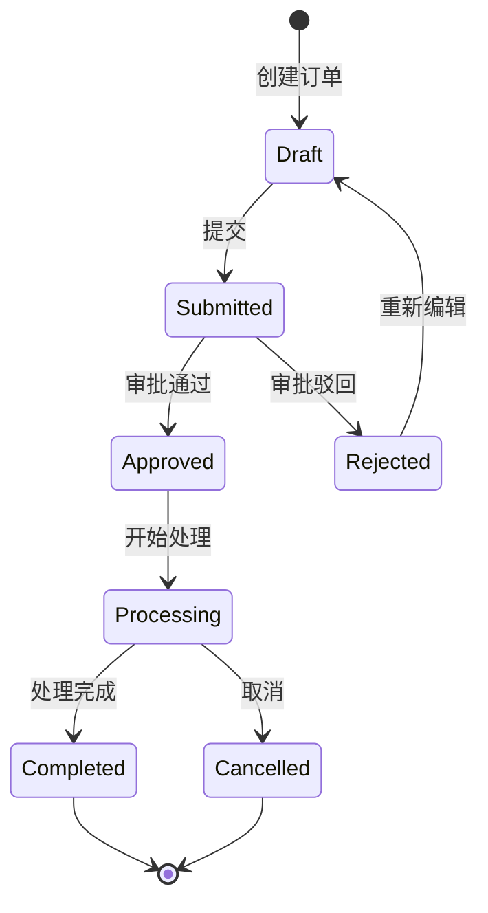

# Workflow: 详细设计（Detailed Design）

6个阶段：模块拆解 → 接口定义 → 数据模型 → 时序图 → 状态机 → 文档生成。

输出10章详细设计文档。

---

## Stage 1: 模块拆解（Module Decomposition）

### 输入
- 架构设计文档中的模块划分
- PRD 中的功能需求

### 处理步骤
1. 分析架构设计中的模块定义
2. 将每个模块拆解为具体的组件/类
3. 定义组件间的调用关系
4. 识别核心组件和辅助组件

### 拆解粒度
- 每个模块拆解为 3-10 个组件
- 每个组件职责单一、功能内聚
- 组件间通过接口调用，不直接依赖实现

### 输出
- 模块-组件映射表
- 组件职责说明
- 组件依赖关系图

---

## Stage 2: 接口定义（Interface Definition）

### 输入
- Stage 1 的组件划分
- 业务流程中的交互需求

### 处理步骤
1. 识别组件间需要暴露的接口
2. 定义接口契约（URL/方法/参数/返回值）
3. 定义错误码和错误处理
4. 编写 OpenAPI 格式文档

### 接口定义模板

```yaml
# 接口名称
path: /api/v1/resource
method: POST
description: 接口描述

# 请求参数
request:
  headers:
    Authorization: Bearer {token}
  body:
    field1:
      type: string
      required: true
      description: 字段说明
      example: "示例值"

# 返回值
response:
  200:
    code: 0
    message: "success"
    data:
      id:
        type: string
        description: 资源ID
  400:
    code: 40001
    message: "参数校验失败"
  401:
    code: 40101
    message: "未授权"
  500:
    code: 50001
    message: "内部错误"
```

### 输出
- 接口清单（URL/方法/说明）
- 接口详细定义（OpenAPI 格式）
- 错误码表
- 接口调用时序说明

---

## Stage 3: 数据模型（Data Model）

### 输入
- 接口定义中的数据结构
- 业务实体关系

### 处理步骤
1. 识别核心业务实体
2. 设计实体关系（ER 图）
3. 编写 DDL 建表语句
4. 定义索引策略

### ER 图示例（Mermaid）



### DDL 模板

```sql
CREATE TABLE `t_user` (
  `id` bigint NOT NULL AUTO_INCREMENT COMMENT '主键',
  `username` varchar(64) NOT NULL COMMENT '用户名',
  `email` varchar(128) NOT NULL COMMENT '邮箱',
  `status` tinyint NOT NULL DEFAULT 1 COMMENT '状态：1-正常 2-禁用',
  `created_at` timestamp NOT NULL DEFAULT CURRENT_TIMESTAMP COMMENT '创建时间',
  `updated_at` timestamp NOT NULL DEFAULT CURRENT_TIMESTAMP ON UPDATE CURRENT_TIMESTAMP COMMENT '更新时间',
  PRIMARY KEY (`id`),
  UNIQUE KEY `uk_username` (`username`),
  UNIQUE KEY `uk_email` (`email`)
) ENGINE=InnoDB DEFAULT CHARSET=utf8mb4 COMMENT='用户表';
```

### 输出
- ER 图（Mermaid）
- DDL 建表脚本（可直接执行）
- 索引设计说明
- 数据字典

---

## Stage 4: 时序图（Sequence Diagram）

### 输入
- 核心业务流程
- 接口定义

### 处理步骤
1. 识别核心业务场景（5-10个）
2. 为每个场景绘制时序图
3. 标注接口调用和数据流

### 时序图模板（Mermaid）



### 输出
- 核心场景时序图（5-10个）
- 异常流程时序图
- 接口调用顺序说明

---

## Stage 5: 状态机（State Machine）

### 输入
- 有状态的业务对象
- PRD 中的业务规则

### 处理步骤
1. 识别有状态的业务对象（订单/工单/审批等）
2. 定义状态列表
3. 定义状态流转规则
4. 绘制状态机图

### 状态机模板（Mermaid）



### 输出
- 状态机图（每个有状态对象一个）
- 状态定义表
- 流转规则表（源状态/目标状态/触发条件/动作）

---

## Stage 6: 文档生成（Document Generation）

### 10章文档模板

#### 第1章：文档概述
- 文档目的和范围
- 读者对象
- 术语定义
- 参考文档

#### 第2章：模块设计
- 模块-组件映射
- 组件职责说明
- 组件依赖关系图

#### 第3章：接口设计
- 接口清单
- 接口详细定义（OpenAPI）
- 错误码定义
- 接口版本管理策略

#### 第4章：数据模型
- ER 图
- 数据表设计
- DDL 脚本
- 索引设计
- 数据字典

#### 第5章：时序设计
- 核心场景时序图
- 异常流程时序图
- 接口调用说明

#### 第6章：状态设计
- 状态机图
- 状态定义表
- 流转规则表

#### 第7章：缓存设计
- 缓存策略
- 缓存数据结构
- 缓存更新机制
- 缓存击穿/穿透/雪崩防护

#### 第8章：安全设计
- 接口认证方案
- 数据加密方案
- 权限控制方案
- 敏感数据处理

#### 第9章：性能设计
- 关键接口性能目标
- 性能优化策略
- 批量处理方案
- 异步处理方案

#### 第10章：异常设计
- 异常分类和处理策略
- 重试机制
- 降级方案
- 熔断限流

### 输出
- 完整详细设计文档（Markdown/DOCX）
- DDL 脚本文件（.sql）
- 接口定义文件（OpenAPI YAML）
- 文件命名：`{项目名}-详细设计文档-v{版本}.md`
