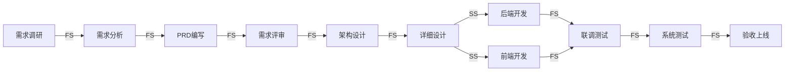

# 甘特图与 WBS 方法论

> 版本：V1.0 | 适用技能：gantt-visualizer | 编写日期：2026-05-28
> 来源：飞书知识库「项目管理规范-完整模板」+ 蒲阳生活项目 9 Sprint 实例

---

## 一、WBS 工作分解结构

### 1.1 分解原则

| 原则 | 说明 |
|------|------|
| 100% 覆盖 | WBS 必须覆盖项目范围内的所有工作，不多不少 |
| 互斥原则 | 同一层级的工作包之间不能有重叠 |
| 粒度适中 | 最底层工作包 8-80 小时（1-10 人天） |
| 名词命名 | 用交付物名词命名（如「用户管理模块」），不用动词（如「开发用户管理」） |
| 不超过 4 层 | 项目 → 阶段 → 模块 → 工作包，最多 4 级 |
| 可分配 | 每个工作包必须能分配给一个责任人 |

### 1.2 WBS 层级结构

```
Level 1: 项目（Project）
  Level 2: 阶段（Phase）
    Level 3: 模块（Module）
      Level 4: 工作包（Work Package）
```

### 1.3 WBS 编号规范

```
1.0  项目
  1.1  需求阶段
    1.1.1  需求调研
    1.1.2  需求分析
    1.1.3  PRD编写
    1.1.4  需求评审
  1.2  设计阶段
    1.2.1  系统架构设计
    1.2.2  详细设计
    1.2.3  数据库设计
    1.2.4  UI/UX设计
  1.3  开发阶段
    1.3.1  后端开发
      1.3.1.1  会员中心
      1.3.1.2  订单中心
      1.3.1.3  支付中心
    1.3.2  前端开发
      1.3.2.1  C端小程序
      1.3.2.2  B端H5
      1.3.2.3  G端后台
  1.4  测试阶段
    1.4.1  功能测试
    1.4.2  性能测试
    1.4.3  安全测试
    1.4.4  验收测试
  1.5  上线阶段
    1.5.1  部署实施
    1.5.2  用户培训
    1.5.3  项目验收
```

---

## 二、WBS 到甘特图转换规则

### 2.1 转换映射

| WBS 元素 | 甘特图元素 | 视觉表示 |
|---------|-----------|---------|
| 阶段（Level 2） | 分组行 | 粗条 + 折叠/展开 |
| 模块（Level 3） | 任务行 | 标准条形 |
| 工作包（Level 4） | 任务行 | 标准条形 + 进度百分比 |
| 里程碑 | 菱形标记 | ◆ 红色菱形 |
| 依赖关系 | 连线 | 箭头（FS/FF/SS/SF） |
| 关键路径 | 红色高亮 | 红色条形 + 红色连线 |

### 2.2 时间计算规则

| 参数 | 计算方式 |
|------|---------|
| 开始时间 | `max(所有前置任务完成时间)` 或 `项目开始日期` |
| 结束时间 | `开始时间 + 工期 - 1` |
| 工期 | 从 WBS 工作包提取（人天 → 自然日：`人天 × 1.5`，考虑并行和缓冲） |
| 完成率 | `0%`（初始）/ 实际跟踪时更新 |

### 2.3 里程碑设置规则

在以下节点设置里程碑：

| 里程碑 | 触发条件 | 甘特图标记 |
|--------|---------|-----------|
| M1 需求确认 | PRD评审通过 | ◆ 红色菱形 |
| M2 设计完成 | 详细设计评审通过 | ◆ 红色菱形 |
| M3 开发完成 | 所有功能开发完毕 + 代码审查通过 | ◆ 红色菱形 |
| M4 测试通过 | S1/S2缺陷100%关闭 | ◆ 红色菱形 |
| M5 上线发布 | 验收通过 + 生产部署完成 | ◆ 红色菱形 |

---

## 三、4 种依赖类型

### 3.1 依赖类型详解

| 类型 | 缩写 | 含义 | 示例 |
|------|------|------|------|
| 完成-开始 | **FS** (Finish-to-Start) | 前置完成后后续才能开始 | 详细设计完成后才能编码 |
| 完成-完成 | **FF** (Finish-to-Finish) | 前置完成后后续才能完成 | 测试必须在开发完成后才能结束 |
| 开始-开始 | **SS** (Start-to-Start) | 前置开始后后续才能开始 | 前端开发与后端开发同时开始 |
| 开始-完成 | **SF** (Start-to-Finish) | 前置开始后后续才能完成 | 极少使用（供应商到货后替换临时方案） |

### 3.2 搭接时间（Lead/Lag）

| 类型 | 含义 | 示例 |
|------|------|------|
| Lead（超前） | FS - 2天 = 前置完成前2天即可开始 | 编码完成前2天开始编写测试用例 |
| Lag（滞后） | FS + 3天 = 前置完成后3天才能开始 | 部署完成后3天开始性能测试（数据预热） |

### 3.3 依赖关系 Mermaid 表示



---

## 四、关键路径分析方法

### 4.1 正向计算（最早时间）

```
ES(最早开始) = max(EF of 所有前置任务)
EF(最早完成) = ES + Duration
```

### 4.2 反向计算（最晚时间）

```
LF(最晚完成) = min(LS of 所有后续任务)
LS(最晚开始) = LF - Duration
```

### 4.3 浮动时间

```
Total Float(总浮动) = LS - ES = LF - EF
Free Float(自由浮动) = min(ES of 后续任务) - EF

关键路径：Total Float = 0 的任务链
```

### 4.4 关键路径识别算法

```
1. 正向遍历：从起点到终点，计算每个任务的 ES / EF
2. 反向遍历：从终点到起点，计算每个任务的 LS / LF
3. 计算浮动：Total Float = LS - ES
4. 识别关键路径：Total Float = 0 的连续路径
```

### 4.5 甘特图中的关键路径可视化

- 关键路径任务：**红色条形**
- 非关键路径任务：**蓝色条形**
- 浮动时间：灰色半透明条形延伸
- 里程碑：红色菱形 ◆

---

## 五、资源平衡技术

### 5.1 资源超分配检测

```
检测规则：
  对每个资源（人员），按天汇总分配工作量
  IF 单日工作量 > 8小时:
    标记为「资源超分配」
    触发资源平衡
```

### 5.2 资源平衡方法

| 方法 | 说明 | 适用场景 |
|------|------|---------|
| 延迟非关键任务 | 利用浮动时间延迟非关键路径任务 | 浮动时间充足 |
| 拆分任务 | 将长任务拆分为多个短任务，中间插入其他工作 | 允许中断的任务 |
| 增加资源 | 为超分配任务增加人员 | 预算允许、可并行 |
| 调整依赖 | 将 FS 改为 SS + 搭接 | 前后任务可部分并行 |

### 5.3 资源分配矩阵

```markdown
| 资源 \ Sprint | S1 | S2 | S3 | S4 | S5 | S6 | S7 | S8 |
|---------------|----|----|----|----|----|----|----|----|
| 后端-张三(1)  | ██ │ ██ │ ██ │ ██ │ ██ │ ██ │    │    |
| 后端-李四(1)  │    │ ██ │ ██ │ ██ │ ██ │ ██ │ ██ │    |
| 前端-王五(1)  │    │    │ ██ │ ██ │ ██ │ ██ │ ██ │    |
| 测试-赵六(1)  │    │    │    │ ██ │ ██ │ ██ │ ██ │ ██ |
```

（██ = 全职参与该 Sprint）

---

## 六、Sprint 规划方法

### 6.1 Sprint 基本参数

| 参数 | 推荐值 | 说明 |
|------|--------|------|
| Sprint 周期 | 2-4 周 | 固定周期，不因任务量变化 |
| 团队速率 | 历史平均 | 前2-3个Sprint后可预测 |
| 需求容量 | 团队速率 × 80% | 留20%缓冲 |
| 评审频率 | 每Sprint末 | Sprint Review + Retrospective |

### 6.2 蒲阳生活项目 9 Sprint 规划实例

| Sprint | 周次 | 主题 | 主要交付物 |
|--------|------|------|-----------|
| S0 | W1-W2 | 项目准备 | 环境搭建/技术预研/设计规范 |
| S1 | W3-W6 | 核心中台 | 会员中心/订单中心/支付中心 |
| S2 | W7-W10 | 停车业务 | 停车模块/充电模块/计费引擎 |
| S3 | W11-W14 | 生活服务 | 食堂/加油/核销模块 |
| S4 | W15-W18 | B端/G端 | 商户管理/运营后台 |
| S5 | W19-W20 | 集成联调 | 全模块联调/第三方对接 |
| S6 | W21-W24 | 测试优化 | 功能测试/性能测试/缺陷修复 |
| S7 | W25-W26 | 验收培训 | UAT/用户培训/文档交付 |
| S8 | W27-W28 | 上线运维 | 生产部署/监控/质保启动 |

### 6.3 Sprint 规划 JSON 数据结构

```json
{
  "project": "蒲阳生活综合服务平台",
  "startDate": "2026-05-01",
  "sprints": [
    {
      "id": "S0",
      "name": "项目准备",
      "start": "2026-05-01",
      "end": "2026-05-14",
      "tasks": [
        {
          "id": "T001",
          "name": "技术环境搭建",
          "duration": 5,
          "assignee": "架构师",
          "progress": 0,
          "dependencies": [],
          "milestone": false
        },
        {
          "id": "T002",
          "name": "设计规范制定",
          "duration": 3,
          "assignee": "设计师",
          "progress": 0,
          "dependencies": [],
          "milestone": false
        }
      ],
      "milestones": [
        { "name": "S0评审通过", "date": "2026-05-14" }
      ]
    },
    {
      "id": "S1",
      "name": "核心中台开发",
      "start": "2026-05-15",
      "end": "2026-06-11",
      "tasks": [
        { "id": "T010", "name": "会员中心后端", "duration": 10, "assignee": "后端1", "progress": 0, "dependencies": [] },
        { "id": "T011", "name": "会员中心前端", "duration": 8, "assignee": "前端1", "progress": 0, "dependencies": ["T010"] },
        { "id": "T012", "name": "订单中心后端", "duration": 12, "assignee": "后端2", "progress": 0, "dependencies": ["T010"] },
        { "id": "T013", "name": "支付中心后端", "duration": 10, "assignee": "后端1", "progress": 0, "dependencies": ["T012"] },
        { "id": "T014", "name": "支付中心联调", "duration": 5, "assignee": "后端1", "progress": 0, "dependencies": ["T013"] }
      ],
      "milestones": [
        { "name": "核心中台联调通过", "date": "2026-06-11" }
      ]
    }
  ]
}
```

---

## 七、甘特图交互功能规范

### 7.1 基础交互

| 功能 | 操作 | 效果 |
|------|------|------|
| 拖拽调整 | 鼠标拖拽任务条 | 调整任务开始/结束时间 |
| 缩放 | 滚轮 / 按钮切换 | 日/周/月视图切换 |
| 折叠/展开 | 点击分组行 | 展开/收起子任务 |
| 进度显示 | 条形内填充 | 已完成部分填充颜色 |
| 今日线 | 红色竖线 | 标记当前日期 |

### 7.2 高级交互

| 功能 | 说明 |
|------|------|
| 关键路径高亮 | 切换显示/隐藏关键路径（红色） |
| 基线对比 | 显示计划基线 vs 实际进度 |
| 资源视图 | 按资源（人员）分组查看负载 |
| 里程碑标记 | 红色菱形 ◆ 标注关键节点 |
| 依赖连线 | 箭头显示 FS/FF/SS/SF 依赖关系 |
| 浮动时间 | 非关键任务显示灰色浮动条 |

### 7.3 导出格式

| 格式 | 说明 |
|------|------|
| PNG | 截图导出，适合汇报材料 |
| HTML | 完整交互式 HTML，可直接浏览器打开 |
| PDF | 打印友好格式 |
| Mermaid | 降级方案，适合嵌入 Markdown |

---

## 八、工作量估算方法

| 方法 | 精度 | 公式/说明 | 适用阶段 |
|------|------|----------|---------|
| 专家法 (Delphi) | ±30% | 多位专家独立估算，取平均值 | 项目初期 |
| 类比法 | ±20% | 参考同类项目历史数据 | 有历史数据时 |
| 三点法 (PERT) | ±15% | `(乐观O + 4×最可能M + 悲观P) / 6` | 详细设计后 |
| 功能点法 | ±10% | 按功能点数 × 复杂度权重 | 需求明确后 |

### 蒲阳项目估算实例

| 角色 | 人天 | 占比 |
|------|------|------|
| 后端开发 | 308 | 46.4% |
| 前端开发 | 198 | 29.8% |
| 测试 | 128 | 19.3% |
| 设计 | 41 | 6.2% |
| **总计** | **664** | **100%** |

---

## 九、甘特图生成工作流

### 核心流程

```
1. 解析输入
   ├── WBS 缩进文本 → 解析层级关系
   ├── Markdown 表格 → 解析任务列表
   └── JSON/自然语言 → 结构化数据

2. 数据校验
   ├── 时间合理性（结束 ≥ 开始）
   ├── 依赖无循环检测
   └── 资源分配检查

3. 计算排期
   ├── 正向计算（ES/EF）
   ├── 反向计算（LS/LF）
   ├── 识别关键路径
   └── 计算浮动时间

4. 生成 HTML
   ├── 内置 CSS + JS 模板
   ├── 渲染任务条形 + 依赖连线
   ├── 渲染里程碑 + 今日线
   └── 响应式布局适配

5. 输出
   ├── 自包含 HTML（优先）
   └── Mermaid 降级（HTML 失败时）
```

### 数据校验规则

| 规则 | 校验方式 | 处理 |
|------|---------|------|
| 结束 < 开始 | 日期比较 | 标注异常，提示修正 |
| 依赖循环 | 拓扑排序检测 | 标注循环路径，提示修正 |
| 任务 > 200 | 计数 | 建议分组或只展示关键路径 |
| 缺少依赖 | 孤立任务检测 | 标注警告 |
| 工期 = 0 | 数值检查 | 默认设为 1 天 |

---

## 版本记录

| 版本 | 日期 | 变更说明 |
|------|------|---------|
| V1.0 | 2026-05-28 | 初始版本，含 WBS/依赖/关键路径/Sprint 规划完整方法论 |
