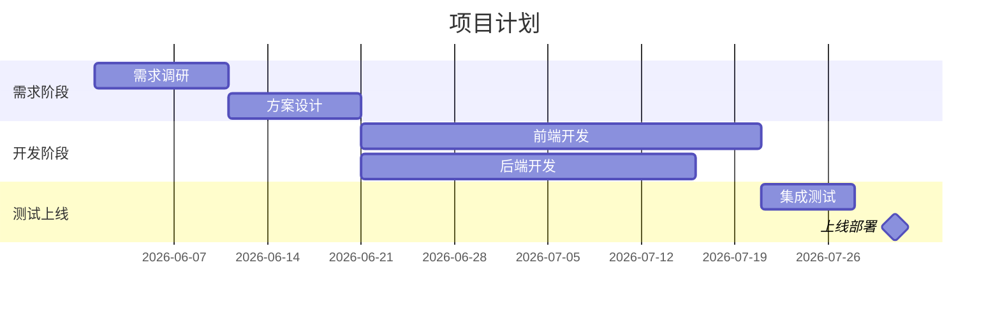

# Workflow: 甘特图生成（Gantt Generation）

3个阶段：解析 WBS → 生成 HTML → 导出调整。

---

## Stage 1: 解析 WBS（Parse WBS）

### 输入
用户提供的任务数据，支持以下格式：

#### 格式 A：WBS 缩进文本
```
1. 项目启动
  1.1 需求调研（2026-06-01 ~ 2026-06-10）
  1.2 方案设计（2026-06-11 ~ 2026-06-20）
2. 开发阶段
  2.1 前端开发（2026-06-21 ~ 2026-07-20）
  2.2 后端开发（2026-06-21 ~ 2026-07-15）
3. 测试上线（2026-07-21 ~ 2026-07-31）
```

#### 格式 B：Markdown 表格
```
| 任务 | 开始 | 结束 | 进度 | 负责人 |
|------|------|------|------|--------|
| 需求调研 | 2026-06-01 | 2026-06-10 | 100% | 张三 |
| 方案设计 | 2026-06-11 | 2026-06-20 | 50% | 李四 |
```

#### 格式 C：自然语言描述
"项目分三个阶段：6月1日到10日做需求调研，11日到20日做方案设计，然后开发一个月，最后7月底测试上线。"

### 处理逻辑
1. 识别输入格式
2. 解析为统一数据结构：

```json
{
  "tasks": [
    {
      "id": "1",
      "name": "项目启动",
      "start": "2026-06-01",
      "end": "2026-06-20",
      "progress": 0,
      "level": 0,
      "children": [
        {
          "id": "1.1",
          "name": "需求调研",
          "start": "2026-06-01",
          "end": "2026-06-10",
          "progress": 100,
          "level": 1,
          "assignee": "张三"
        }
      ]
    }
  ],
  "milestones": [
    {
      "name": "需求评审通过",
      "date": "2026-06-10"
    }
  ]
}
```

3. 数据校验
   - 结束时间 >= 开始时间
   - 依赖关系无循环
   - 父任务时间覆盖子任务

### 输出
- 结构化任务数据（JSON）
- 校验结果（异常任务列表）

---

## Stage 2: 生成 HTML（Generate HTML）

### HTML 模板结构

```html
<!DOCTYPE html>
<html lang="zh-CN">
<head>
  <meta charset="UTF-8">
  <title>项目甘特图</title>
  <style>
    /* 内联 CSS */
    /* 左侧任务列表 + 右侧时间轴条形图 */
    /* 拖拽样式 */
    /* 缩放样式 */
    /* 今日线样式 */
    /* 里程碑样式 */
  </style>
</head>
<body>
  <!-- 工具栏：视图切换 / 缩放 / 导出 -->
  <!-- 甘特图主体 -->
  <script>
    // 内联 JS
    // 任务渲染
    // 拖拽逻辑
    // 缩放逻辑
    // 今日线更新
    // 导出功能
  </script>
</body>
</html>
```

### 核心功能
1. **任务条拖拽**：拖拽调整任务开始/结束时间
2. **时间轴缩放**：日/周/月三种视图
3. **分组折叠**：点击父任务折叠/展开子任务
4. **今日线**：红色竖线标记当前日期
5. **进度显示**：任务条内显示完成百分比
6. **里程碑**：菱形标记关键节点
7. **依赖关系**：箭头线连接前置后继任务
8. **工具提示**：鼠标悬停显示详细信息
9. **导出功能**：导出为 PNG 或打印

### 视觉设计
- 颜色方案：蓝色系（默认），支持切换
- 字体：系统默认字体
- 间距：紧凑但清晰
- 周末：灰色背景区分

### 输出
- 自包含 HTML 文件
- 文件命名：`{项目名}-甘特图.html`

---

## Stage 3: 导出与调整（Export）

### 导出选项
1. **HTML 文件**：直接保存，可在浏览器中打开编辑
2. **PNG 截图**：使用 html2canvas 或浏览器截图
3. **打印**：浏览器打印，A3 横向推荐

### Mermaid 降级方案

当 HTML 甘特图过于复杂或用户需要简单版本时，降级为 Mermaid：



### 降级条件
- 任务数量超过 200 个
- 用户明确要求简单版本
- HTML 生成失败

---

## 质量检查

生成完成后检查：
- [ ] 所有任务正确显示
- [ ] 时间轴范围覆盖所有任务
- [ ] 依赖关系箭头正确
- [ ] 拖拽功能正常
- [ ] 缩放功能正常
- [ ] 导出功能正常
- [ ] 中文显示正确
- [ ] 在 Chrome/Edge 中显示正常
