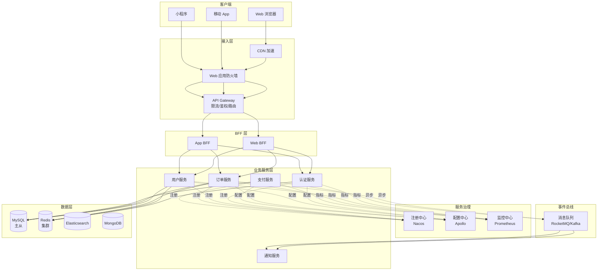
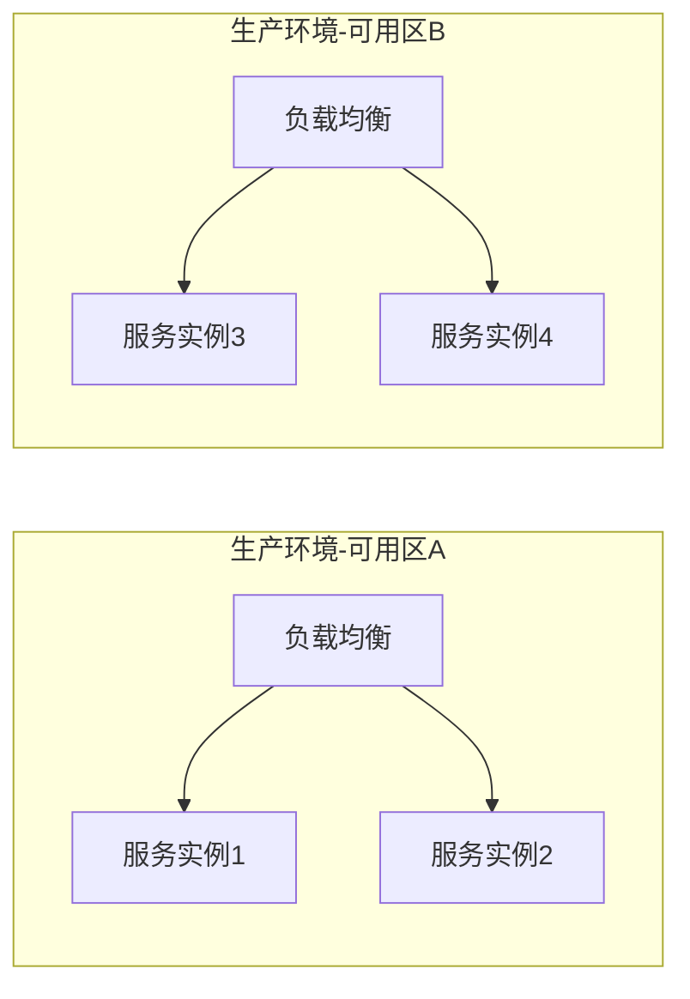
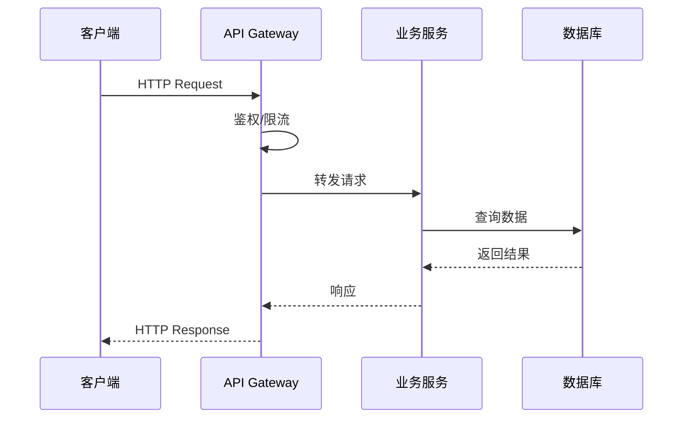

# 架构模式与技术选型指南

> 面向方案架构师和售前工程师，提供架构模式对比、技术选型矩阵、行业架构模板和方案编写规范。
> 适用于技术方案第 5 章「技术选型」、架构设计方案第 4-6 章的编写参考。

---

## 一、主流架构模式对比

### 1.1 四种主流架构模式

| 维度 | 单体架构 (Monolithic) | 微服务架构 (Microservices) | 事件驱动架构 (EDA) | 无服务器架构 (Serverless) |
|------|----------------------|---------------------------|-------------------|-------------------------|
| **复杂度** | 低 | 高 | 高 | 中 |
| **可扩展性** | 垂直扩展为主 | 水平扩展，独立伸缩 | 高度解耦，异步扩展 | 按需自动伸缩 |
| **部署方式** | 整体部署 | 独立部署，CI/CD | 异步触发，松耦合 | 平台托管，按调用计费 |
| **开发效率** | 前期快，后期慢 | 前期慢，后期快 | 前期慢，后期快 | 前期快，冷启动有延迟 |
| **运维成本** | 低（单体监控） | 高（分布式治理） | 高（消息链路追踪） | 低（平台托管） |
| **团队要求** | 全栈即可 | DevOps + 服务治理 | 消息中间件 + 异步编程 | 云原生 + Function 编排 |
| **适用规模** | 小型项目 / MVP | 中大型系统 | 实时/异步场景 | 事件触发 / 流量波动大 |
| **典型技术** | Spring Boot 单体 | Spring Cloud / Dubbo | Kafka + CQRS | AWS Lambda / 阿里云 FC |
| **数据一致性** | 强一致（本地事务） | 最终一致（分布式事务） | 最终一致（事件溯源） | 最终一致 |
| **故障影响** | 全局不可用 | 局部隔离 | 消息缓冲容忍 | 单函数故障隔离 |

### 1.2 架构模式决策树

```
项目启动
  ├─ Q1: 系统用户规模？
  │   ├─ < 1万用户，业务简单 → 单体架构
  │   ├─ 1万-100万用户，多业务域 → 微服务架构
  │   └─ > 100万用户，实时性要求高 → 事件驱动 + 微服务
  │
  ├─ Q2: 是否有明显的异步/实时场景？
  │   ├─ 是（IoT/日志/通知/数据管道） → EDA 作为补充
  │   └─ 否 → 继续
  │
  ├─ Q3: 团队规模和 DevOps 成熟度？
  │   ├─ 团队 < 5人，无专职运维 → 单体 or Serverless
  │   ├─ 团队 5-20人，有运维 → 微服务（限 3-5 个服务）
  │   └─ 团队 > 20人，DevOps 成熟 → 微服务（按业务域拆分）
  │
  ├─ Q4: 流量特征？
  │   ├─ 流量平稳可预测 → 微服务 / 单体
  │   ├─ 流量波动大，有明显波峰波谷 → Serverless
  │   └─ 实时数据流处理 → EDA + 流计算
  │
  └─ 推荐：多数中大型项目 → 微服务为主 + EDA 补充
```

### 1.3 混合架构实践

实际项目中极少采用单一架构，推荐混合模式：

| 层次 | 推荐架构 | 说明 |
|------|---------|------|
| 接入层 | API Gateway + BFF | 统一入口，协议转换 |
| 业务服务层 | 微服务 | 按业务域拆分，独立部署 |
| 异步处理层 | 事件驱动 | 消息通知、数据同步、日志处理 |
| 边缘/轻量层 | Serverless | OSS 触发、定时任务、Webhook |
| 数据层 | 多元存储 | 关系型 + 缓存 + 搜索 + 文档 |

---

## 二、微服务架构设计模式

### 2.1 核心设计模式速查

| 模式 | 解决问题 | 核心组件 | 适用场景 | 复杂度 |
|------|---------|---------|---------|--------|
| **API Gateway** | 统一入口、路由、限流、鉴权 | Kong / APISIX / Spring Cloud Gateway | 所有微服务项目（必选） | 中 |
| **BFF (Backend for Frontend)** | 多端适配，按端聚合数据 | 各端独立 BFF 服务 | 多端（Web/App/小程序） | 中 |
| **Service Mesh** | 服务间通信治理、流量管理 | Istio / Linkerd | 大规模微服务（50+ 服务） | 高 |
| **CQRS** | 读写分离，独立优化读写模型 | Command Service + Query Service + Event Bus | 高读写比，复杂查询场景 | 高 |
| **Event Sourcing** | 状态变更可追溯，事件驱动 | Event Store + Replay Engine | 审计要求高、需事件回放 | 高 |
| **Saga** | 分布式事务协调 | 编排式 / 协调式 | 跨服务事务（订单/支付/库存） | 高 |
| **Circuit Breaker** | 服务故障隔离，防止雪崩 | Hystrix / Sentinel / Resilience4j | 所有微服务项目（必选） | 低 |
| **Service Discovery** | 服务注册与发现 | Nacos / Consul / Eureka | 所有微服务项目（必选） | 低 |
| **Config Center** | 集中配置管理，动态刷新 | Nacos / Apollo / Spring Cloud Config | 所有微服务项目（必选） | 低 |
| **Bulkhead** | 资源隔离，故障不扩散 | 线程池隔离 / 信号量隔离 | 核心链路保护 | 中 |

### 2.2 场景-模式匹配

| 业务场景 | 推荐模式组合 | 说明 |
|---------|-------------|------|
| 电商交易系统 | API Gateway + Saga + Circuit Breaker + CQRS | 分布式事务是核心，读写分离优化查询 |
| 政务审批系统 | API Gateway + BFF + Event Sourcing | 审批流程可追溯，多端适配 |
| 金融支付系统 | API Gateway + Saga + Circuit Breaker + Event Sourcing | 强事务一致性，全链路可审计 |
| 内容管理平台 | API Gateway + CQRS + CDN | 读多写少，搜索优化 |
| SaaS 多租户 | API Gateway + BFF + Service Mesh | 租户隔离，流量治理 |

### 2.3 微服务参考架构图



---

## 三、事件驱动架构（EDA）

### 3.1 EDA 核心概念

| 角色 | 职责 | 典型实现 |
|------|------|---------|
| Event Producer | 产生事件，发布到 Broker | 业务服务、IoT 设备、数据库 CDC |
| Event Broker | 事件存储、路由、分发 | Kafka / RocketMQ / RabbitMQ |
| Event Consumer | 订阅事件，执行业务逻辑 | 微服务、Serverless Function |
| Event Store | 事件持久化存储（Event Sourcing） | Kafka（内置） / EventStoreDB |
| Schema Registry | 事件 Schema 管理 | Confluent Schema Registry |

### 3.2 消息中间件对比

| 维度 | Kafka | RocketMQ | RabbitMQ | Pulsar |
|------|-------|----------|----------|--------|
| **定位** | 分布式流平台 | 分布式消息队列 | 传统消息代理 | 云原生消息平台 |
| **吞吐量** | 极高（百万级/s） | 高（十万级/s） | 中（万级/s） | 极高（百万级/s） |
| **延迟** | ms 级 | ms 级 | us 级 | ms 级 |
| **消息可靠性** | 高（副本机制） | 极高（同步刷盘） | 高（ACK 确认） | 高（BookKeeper） |
| **顺序消息** | Partition 级有序 | Queue 级有序 | Queue 级有序 | Partition 级有序 |
| **事务消息** | 支持（Exactly-Once） | 支持（半消息） | 不支持 | 支持 |
| **延迟消息** | 不原生支持 | 支持（18级延迟） | 支持（插件） | 支持 |
| **消息回溯** | 支持（按 Offset） | 支持（按时间戳） | 不支持 | 支持 |
| **运维复杂度** | 高 | 中 | 低 | 高 |
| **适用场景** | 大数据/日志/流处理 | 电商/金融/事务消息 | 中小规模/异步任务 | 多租户/云原生 |
| **社区生态** | 极强（大数据生态） | 强（阿里生态） | 强（多语言客户端） | 中（Apache 孵化） |
| **信创适配** | 无（Apache） | 阿里开源，国产化好 | 无 | 无 |

### 3.3 EDA + Serverless 最佳实践

| 实践项 | 说明 |
|--------|------|
| 事件触发函数 | 消息队列触发 Function，按调用计费，适合突发流量 |
| 扇出模式 | 一个事件触发多个 Function 并行处理（如订单创建 → 通知+积分+日志） |
| 事件链编排 | 多个 Function 通过事件链串联，避免长事务 |
| 死信队列处理 | 处理失败的事件进入 DLQ，人工介入或定时重试 |
| 幂等消费 | Consumer 必须实现幂等，防止重复消费 |
| 事件 Schema 演进 | 使用 Schema Registry 管理 Schema 版本，前后兼容 |

### 3.4 事件模式选择

| 模式 | 特点 | 适用场景 |
|------|------|---------|
| **Event Notification** | 轻量事件，仅通知"发生了什么"，Consumer 自行查询详情 | 解耦通知、状态变更通知 |
| **Event-Carried State Transfer** | 事件携带状态数据，Consumer 无需回查 | 跨服务数据同步 |
| **Event Sourcing** | 所有状态变更以事件序列存储，可重放 | 审计追踪、状态回溯 |
| **CQRS** | 读写模型分离，写侧事件驱动，读侧物化视图 | 高读写比、复杂查询 |

---

## 四、技术选型矩阵（2025-2026）

### 4.1 前端技术栈

| 维度 | React | Vue | Angular |
|------|-------|-----|---------|
| **学习曲线** | 中（JSX + Hooks） | 低（模板语法直观） | 高（TypeScript + RxJS + DI） |
| **生态丰富度** | 极强 | 强 | 中（官方统一） |
| **企业采用度** | 极高（互联网/外企） | 极高（国内/政企） | 高（大型企业/金融） |
| **TypeScript 支持** | 优秀 | 优秀（Vue 3） | 原生支持 |
| **性能** | 优秀（Fiber） | 优秀（Proxy 响应式） | 良好 |
| **移动端方案** | React Native | uni-app / 小程序 | Ionic / NativeScript |
| **推荐场景** | 复杂交互/中大型/SaaS | 中后台/政企/快速交付 | 大型企业/金融/长期项目 |

**SSR 框架对比**

| 框架 | 基于 | 优势 | 劣势 | 推荐场景 |
|------|------|------|------|---------|
| Next.js | React | 生态最强，App Router，Vercel 托管 | 学习曲线陡，Bundle 偏大 | React 项目 SSR/SSG |
| Nuxt | Vue | Vue 生态整合好，上手快 | 生态弱于 Next.js | Vue 项目 SSR/SSG |
| SvelteKit | Svelte | 编译时优化，性能极佳 | 生态较小，社区资源少 | 性能敏感/创新型项目 |

**企业 UI 框架选型**

| 框架 | 技术栈 | 生态 | 适合场景 | 设计系统目录 |
|------|--------|------|---------|-------------|
| Ant Design | React | 最丰富 | 中后台/Dashboard | `ant-design-pro设计系统/` |
| Element Plus | Vue | 国内政企主流 | Vue 项目/政企 | `element-plus设计系统/` |
| TDesign | React/Vue | 腾讯系 | 腾讯系项目 | `tdesign设计系统/` |
| Arco Design | React/Vue | 字节系 | 现代化后台 | `arco-design设计系统/` |
| Semi Design | React | 暗色模式好 | 多品牌 SaaS | `semi-design设计系统/` |
| shadcn/ui | React+Tailwind | 高度可定制 | SaaS/创业产品 | `shadcn-ui设计系统/` |

### 4.2 后端技术栈

| 维度 | Java (Spring) | Go | Node.js | Python |
|------|---------------|-----|---------|--------|
| **开发效率** | 中（模板代码多） | 中（简洁但显式错误处理） | 高（JS 全栈） | 极高（语法简洁） |
| **运行性能** | 良好（JIT 优化） | 极高（编译型，并发好） | 良好（V8 引擎） | 一般（GIL 限制） |
| **并发模型** | 虚拟线程（JDK 21）/ WebFlux | Goroutine（原生高并发） | 单线程事件循环 | asyncio / 多进程 |
| **微服务生态** | 极强（Spring Cloud 全家桶） | 中（gRPC / Kratos / Go-Zero） | 中（NestJS） | 弱（Nameko） |
| **企业人才池** | 极大（国内主流） | 增长快（云原生趋势） | 大（前端转后端） | 大（AI/数据方向） |
| **信创适配** | 优（国产 JDK：毕昇/龙井） | 优（编译跨平台） | 一般 | 一般 |
| **推荐场景** | 企业级/金融/政务 | 高并发/云原生/中间件 | BFF/实时通信/小团队 | AI/数据分析/ML |

**选型决策矩阵**

| 项目特征 | 推荐 | 理由 |
|---------|------|------|
| 传统企业信息化 | Java (Spring Boot) | 人才多、框架成熟、信创友好 |
| 高并发互联网 | Go | 性能好、内存占用低、并发原生支持 |
| 快速迭代/小团队 | Node.js (NestJS) | 前后端统一语言，开发效率高 |
| AI + 业务混合 | Python (FastAPI) + Go/Java | AI 用 Python，业务用 Go/Java |
| 信创项目 | Java (国产 JDK) + Go | 国产化要求，两个语言都有支持 |

### 4.3 数据库选型

**关系型数据库**

| 数据库 | 优势 | 劣势 | 适用场景 |
|--------|------|------|---------|
| MySQL | 生态最成熟，DBA 人才多，信创（TiDB 兼容） | 复杂查询性能弱于 PG，JSON 支持一般 | 通用业务系统、中小规模 |
| PostgreSQL | 功能强大（JSONB/全文搜索/地理信息），扩展性好 | 国内 DBA 人才偏少，运维复杂度略高 | 复杂查询、GIS、数据治理 |
| TiDB | MySQL 兼容 + 分布式 + HTAP，信创友好 | 运维门槛高，资源消耗大 | 大规模数据、信创项目 |
| OceanBase | 金融级分布式，Oracle 兼容，信创 | 闭源版本收费，社区版功能受限 | 金融/大型企业、Oracle 替换 |

**NoSQL / 缓存 / 搜索**

| 数据库 | 类型 | 适用场景 | 说明 |
|--------|------|---------|------|
| Redis | KV 缓存 | 会话/缓存/排行榜/限流 | 几乎所有项目必选 |
| MongoDB | 文档型 | 非结构化数据/内容管理/日志 | Schema 灵活，适合快速迭代 |
| Elasticsearch | 搜索引擎 | 全文搜索/日志分析/监控 | ELK 生态，日志场景标配 |
| ClickHouse | 列式 OLAP | 大数据分析/报表/BI | 查询性能极高，适合 OLAP |
| TDengine | 时序数据库 | IoT/监控/工业数据 | 国产，写入性能优异 |

**OLTP vs OLAP 选型指南**

| 需求特征 | OLTP（联机事务） | OLAP（联机分析） |
|---------|-----------------|-----------------|
| 数据量 | GB-TB | TB-PB |
| 操作类型 | 增删改查，短事务 | 复杂聚合查询 |
| 响应要求 | ms 级 | 秒级-分钟级 |
| 推荐选型 | MySQL / PostgreSQL / TiDB | ClickHouse / Doris / StarRocks |
| 典型场景 | 业务系统核心库 | 数据仓库 / BI 报表 / 数据大屏 |

**场景匹配表**

| 场景 | 主库 | 缓存 | 搜索 | 分析 |
|------|------|------|------|------|
| 电商系统 | MySQL | Redis | Elasticsearch | ClickHouse |
| 内容平台 | PostgreSQL | Redis | Elasticsearch | - |
| 政务审批 | MySQL/TiDB | Redis | - | Doris |
| IoT 平台 | TiDB | Redis | Elasticsearch | TDengine |
| 金融交易 | TiDB/OceanBase | Redis | - | ClickHouse |

### 4.4 中间件选型

**消息队列选型**

| 场景 | 推荐 | 理由 |
|------|------|------|
| 日志/大数据流 | Kafka | 吞吐量最高，大数据生态整合 |
| 电商/金融事务 | RocketMQ | 事务消息、延迟消息、国产信创 |
| 中小项目异步任务 | RabbitMQ | 上手简单，功能够用 |
| 多租户/云原生 | Pulsar | 多租户隔离，存储计算分离 |
| 信创项目 | RocketMQ | 阿里开源，国产化程度最高 |

**Service Mesh 选型**

| 方案 | 优势 | 劣势 | 适用场景 |
|------|------|------|---------|
| Istio | 功能最全，社区活跃 | 复杂度高，资源消耗大 | 大规模 K8s 集群（50+ 服务） |
| Linkerd | 轻量，性能好 | 功能少于 Istio | 中小规模 K8s 集群 |
| 不引入 Mesh | 简单直接 | 缺少流量治理 | 服务数 < 20，用 SDK 治理 |

**API Gateway 选型**

| 方案 | 语言 | 优势 | 适用场景 |
|------|------|------|---------|
| APISIX | Lua (OpenResty) | 高性能，插件丰富，国产（Apache） | 国内企业首选，信创友好 |
| Kong | Lua (OpenResty) | 全球生态好，企业版功能全 | 外企/全球化项目 |
| Spring Cloud Gateway | Java | 与 Spring 生态无缝集成 | Spring Cloud 微服务项目 |
| Nginx + Lua | C + Lua | 极致性能 | 超高并发入口，定制化需求 |

---

## 五、行业架构模板

### 5.1 政务云架构模板

**架构特点**：微服务 + 信创适配 + 统一认证 + 数据共享交换

| 层次 | 组件 | 信创替代方案 |
|------|------|-------------|
| 接入层 | API Gateway + WAF | APISIX / 华为 APIG |
| 应用层 | Spring Cloud 微服务 | 麒麟 OS + 毕昇 JDK + 达梦 DB / TiDB |
| 认证层 | 统一身份认证（OAuth2 + SAML） | 对接政务外网统一认证 |
| 数据交换 | 数据共享交换平台 | 主数据管理 + API 数据服务 |
| 中间件 | Nacos + RocketMQ | 东方通 / 宝兰德 |
| 存储 | MinIO / 华为 OBS | 信创对象存储 |
| 监控 | Prometheus + Grafana | 华为云监控 / 阿里云 ARMS |

**部署拓扑**：政务外网区 + 政务内网区（涉密）+ 互联网接入区（对外服务）

**关键设计点**：
- 等保三级合规（网络隔离 + 审计日志 + 数据加密）
- 国产化适配清单（CPU/OS/DB/中间件/浏览器）
- 数据共享交换标准（政务信息资源目录体系）
- 统一用户体系（对接省级/市级统一身份认证）

### 5.2 金融高可用架构模板

**架构特点**：双活/多活 + 分布式事务 + 全链路监控 + 审计合规

| 指标 | 要求 | 实现方式 |
|------|------|---------|
| RTO | < 30秒（核心交易） | 同城双活 + 自动故障切换 |
| RPO | = 0（核心交易） | 同步复制 + 分布式一致性 |
| 可用性 | 99.99% | 多活 + 灰度发布 + 熔断降级 |
| 交易吞吐 | 万级 TPS | 分库分表 + 异步化 + 缓存 |

**核心组件**：

| 组件 | 推荐选型 | 说明 |
|------|---------|------|
| 分布式事务 | Seata / DTMB | AT 模式（自动补偿）/ TCC 模式（手动补偿） |
| 全链路监控 | SkyWalking / ARMS | Trace + Metric + Log 三合一 |
| 灰度发布 | Istio + Argo Rollouts | 金丝雀发布 + A/B 测试 |
| 审计日志 | Event Sourcing + 不可篡改存储 | 全操作留痕，满足监管审计要求 |
| 数据库 | TiDB / OceanBase | 分布式强一致，金融级容灾 |

**RTO/RPO 需求映射**

| 业务等级 | RTO 目标 | RPO 目标 | 架构方案 |
|---------|---------|---------|---------|
| 核心交易（P0） | < 30秒 | 0 | 同城双活 + 同步复制 |
| 重要业务（P1） | < 5分钟 | < 1分钟 | 同城主备 + 半同步复制 |
| 一般业务（P2） | < 30分钟 | < 10分钟 | 异地灾备 + 异步复制 |
| 边缘业务（P3） | < 4小时 | < 1小时 | 冷备 + 定时备份 |

### 5.3 企业中台架构模板

**架构特点**：技术中台 + 数据中台 + 业务中台，能力复用

```
┌─────────────────────────────────────────────┐
│                  前台应用                      │
│  CRM / ERP / OA / 门户 / 移动 App / 小程序    │
└──────────────────┬──────────────────────────┘
                   │ API Gateway
┌──────────────────┴──────────────────────────┐
│               业务中台                        │
│  用户中心 / 订单中心 / 商品中心 / 支付中心     │
│  通知中心 / 权限中心 / 流程中心               │
└──────────────────┬──────────────────────────┘
┌──────────────────┴──────────────────────────┐
│               数据中台                        │
│  数据集成 / 数据治理 / 数据资产 / 数据服务     │
│  BI 报表 / 数据大屏 / 智能分析               │
└──────────────────┬──────────────────────────┘
┌──────────────────┴──────────────────────────┐
│               技术中台                        │
│  统一认证 / 文件服务 / 消息服务 / 任务调度     │
│  日志中心 / 配置中心 / 服务注册 / 监控告警     │
└─────────────────────────────────────────────┘
```

**通用模块清单**

| 模块 | 功能 | 技术选型 |
|------|------|---------|
| 统一认证 (SSO) | OAuth2 / OIDC / SAML / LDAP 对接 | Spring Authorization Server / Keycloak |
| 文件服务 | 上传/下载/预览/权限控制 | MinIO + OnlyOffice / KKFileView |
| 消息中心 | 站内信/短信/邮件/推送/微信 | RocketMQ + 模板引擎 |
| 流程引擎 | 工作流/BPM/审批流 | Flowable / Camunda |
| 任务调度 | 定时任务/分布式调度 | XXL-Job / PowerJob |
| 日志中心 | 操作日志/审计日志/访问日志 | ELK / Loki |
| 数据字典 | 系统配置/枚举管理/多级字典 | 独立微服务 + Redis 缓存 |

### 5.4 IoT / 边缘计算架构模板

**架构特点**：设备接入 + 边缘计算 + 云端同步 + 时序数据

| 层次 | 功能 | 技术选型 |
|------|------|---------|
| 设备层 | 传感器/网关/控制器 | MQTT / CoAP / Modbus / OPC UA |
| 边缘层 | 协议转换/数据清洗/本地决策 | EMQX Edge / KubeEdge / EdgeX Foundry |
| 接入层 | 设备认证/协议网关/流量管控 | EMQX / MQTT Broker 集群 |
| 数据层 | 时序存储/流计算/规则引擎 | TDengine / Kafka Streams / Flink |
| 应用层 | 设备管理/监控大屏/告警/OTA | 自研或 IoT 平台（物联网操作系统） |

**协议选型**

| 协议 | 特点 | 适用场景 |
|------|------|---------|
| MQTT | 轻量、Pub/Sub、QoS 支持、适合弱网 | 大量设备接入、移动端、弱网环境 |
| CoAP | UDP、极轻量、适合受限设备 | 资源极度受限的传感器 |
| HTTP/REST | 通用、调试方便 | 设备数量少、非实时场景 |
| WebSocket | 全双工、实时性好 | 设备状态实时推送、远程控制 |
| Modbus | 工业标准、简单 | 工业设备/PLC 通信 |
| OPC UA | 工业互联标准、安全 | 工业 4.0 / 智能制造 |

---

## 六、方案编写架构图规范

### 6.1 架构图类型

| 图类型 | 对应 C4 层级 | 内容 | 适用章节 |
|--------|-------------|------|---------|
| 系统上下文图 | Level 1 | 系统与外部角色/系统的关系 | 总体架构 |
| 容器图 | Level 2 | 系统内各应用/服务/数据库 | 技术架构 |
| 组件图 | Level 3 | 单个服务内部组件结构 | 应用架构/详细设计 |
| 部署图 | Level 4 | 物理部署拓扑 | 部署方案 |
| 数据流图 | - | 数据在系统间的流转 | 数据架构 |
| 网络拓扑图 | - | 网络分区/安全域/VLAN | 网络架构 |

### 6.2 C4 Model 参考

C4 Model 通过 4 个层级描述软件架构，从宏观到微观逐层展开：

- **Context**：系统上下文，展示目标系统与用户、外部系统的交互
- **Container**：容器级，展示应用、服务、数据库、消息队列等部署单元
- **Component**：组件级，展示单个容器内部的模块、控制器、服务划分
- **Code**：代码级，类图、ER 图（方案中通常不需要）

**方案中推荐使用 Level 1-3**，Level 4 仅在详细设计阶段使用。

### 6.3 Mermaid 语法速查

**架构图常用语法**

```mermaid
# 分层架构
graph TB
    subgraph 接入层
        A[客户端] --> B[API Gateway]
    end
    subgraph 服务层
        B --> C[服务A]
        B --> D[服务B]
    end
    subgraph 数据层
        C --> E[(数据库)]
        D --> F[(缓存)]
    end
```

**部署拓扑图**



**时序图（交互流程）**



### 6.4 配色规范

| 元素类型 | 推荐颜色 | 说明 |
|---------|---------|------|
| 外部系统/用户 | 浅灰 (#E8E8E8) | 表示不在本项目范围 |
| 业务服务 | 蓝色 (#4A90D9) | 核心业务逻辑 |
| 数据存储 | 橙色 (#F5A623) | 数据库/缓存/消息队列 |
| 基础设施 | 绿色 (#7ED321) | 网关/负载均衡/监控 |
| 安全组件 | 红色 (#D0021B) | 防火墙/WAF/认证 |
| 第三方服务 | 紫色 (#9013FE) | SMS/OSS/支付等外部依赖 |

**命名规范**：
- 节点命名：`{中文名称}` + 必要时括号标注技术栈，如 `API Gateway (APISIX)`
- 连线标注：说明数据流方向和协议，如 `--HTTP/REST-->` 或 `-.异步/MQ.->`
- 子图分组：按层次或区域分组，命名如 `subgraph 接入层`

---

## 七、架构评审检查清单

### 7.1 性能维度

| 检查项 | 要求 | 通过标准 |
|--------|------|---------|
| 响应时间 | 核心接口 < 200ms，列表查询 < 500ms | 压测报告达标 |
| 吞吐量 | 满足峰值 TPS 的 1.5 倍 | 压测报告达标 |
| 缓存策略 | 热点数据缓存，缓存命中率 > 80% | 监控数据验证 |
| 数据库优化 | 慢查询 < 100ms，索引覆盖核心查询 | DBA 审核通过 |
| 连接池 | 合理配置，避免连接泄漏 | 连接池监控正常 |
| 异步化 | 非实时操作异步处理，不阻塞主链路 | 链路追踪验证 |

### 7.2 安全维度

| 检查项 | 要求 | 通过标准 |
|--------|------|---------|
| 认证鉴权 | 所有接口经过 Gateway 鉴权 | 安全测试通过 |
| 数据加密 | 传输 HTTPS，敏感字段加密存储 | 密钥管理规范 |
| SQL 注入 | 参数化查询，ORM 框架防护 | 安全扫描无漏洞 |
| XSS/CSRF | 输入校验 + 输出编码 + Token | 安全扫描无漏洞 |
| 日志脱敏 | 敏感信息（密码/手机号/身份证）脱敏 | 日志审计确认 |
| 权限控制 | RBAC / ABAC，最小权限原则 | 权限矩阵审核通过 |
| 等保合规 | 按等保级别（二级/三级）满足要求 | 等保测评通过 |

### 7.3 可扩展性维度

| 检查项 | 要求 | 通过标准 |
|--------|------|---------|
| 水平扩展 | 无状态服务，支持多实例部署 | 弹性伸缩验证 |
| 数据库扩展 | 分库分表策略明确 | 数据增长预估 + 方案可行 |
| 接口版本化 | API 版本管理（v1/v2） | 向后兼容策略明确 |
| 插件化 | 核心功能支持扩展点 | 扩展机制设计文档 |
| 多租户 | SaaS 场景支持数据隔离 | 租户隔离方案明确 |

### 7.4 可靠性维度

| 检查项 | 要求 | 通过标准 |
|--------|------|---------|
| 高可用 | 无单点故障，核心服务多实例 | 架构图无单点 |
| 熔断降级 | 依赖服务故障时自动降级 | 熔断测试通过 |
| 超时重试 | 合理超时设置 + 重试策略 | 链路超时配置合理 |
| 数据备份 | 定时备份 + 异地备份 | 备份恢复演练通过 |
| 容灾方案 | RTO/RPO 满足业务要求 | 容灾切换演练通过 |
| 消息可靠 | 消息不丢失，消费幂等 | 消息可靠性测试通过 |

### 7.5 可维护性维度

| 检查项 | 要求 | 通过标准 |
|--------|------|---------|
| 代码规范 | 统一编码规范 + Sonar 扫描 | 代码质量达标 |
| 日志规范 | 统一日志格式，链路 TraceId 贯穿 | 日志可检索可追踪 |
| 监控告警 | 核心指标监控 + 告警阈值 | 监控大盘 + 告警通知 |
| CI/CD | 自动化构建/测试/部署 | 流水线运行正常 |
| 文档完整 | 架构文档 + API 文档 + 运维文档 | 文档评审通过 |
| 配置管理 | 配置外部化，环境隔离 | 配置中心统一管理 |

---

> 本指南持续更新，最后更新：2026-05-28。技术选型建议结合项目实际情况和团队能力综合决策，本指南提供的是通用参考框架。
